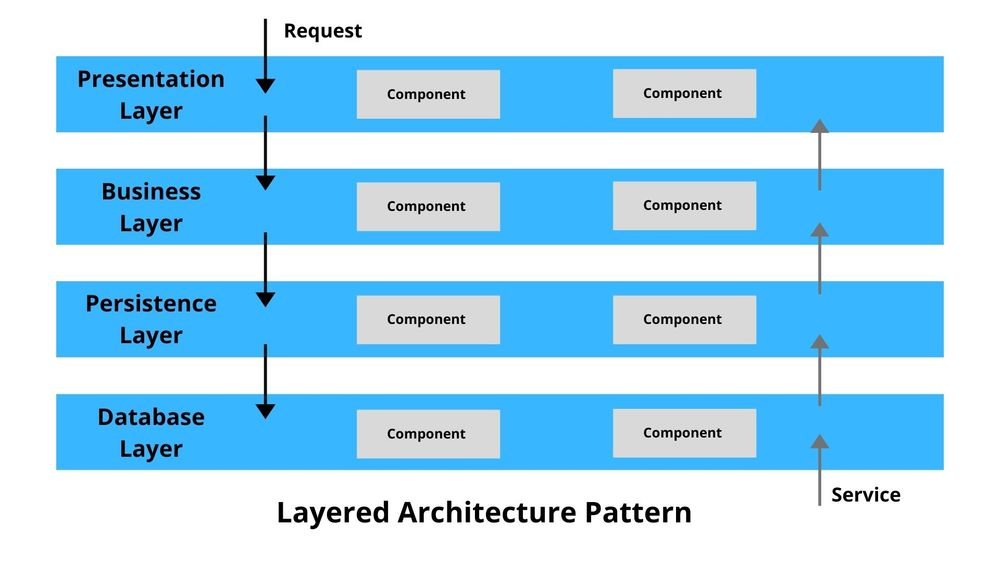
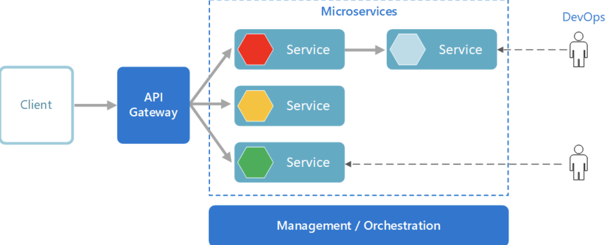
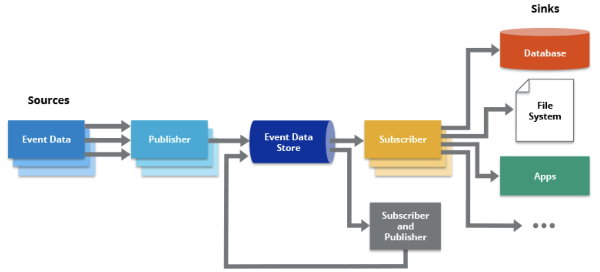
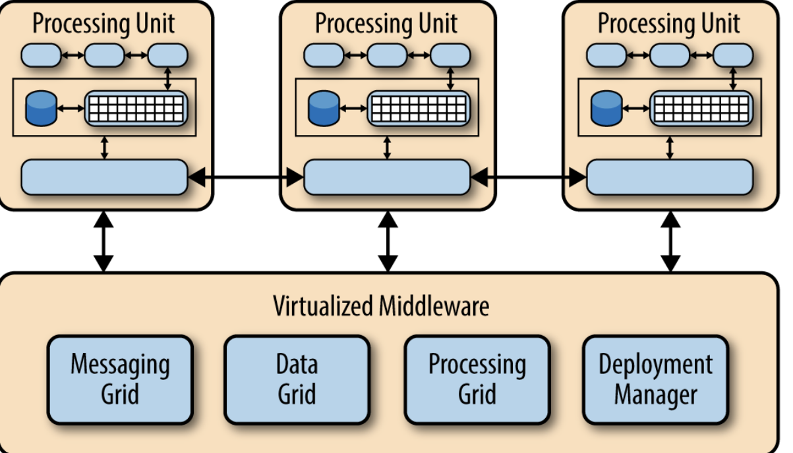

# top 5

Il existe de nombreuses architectures logicielles, chacune adaptée à des besoins et des contextes spécifiques. Cependant, voici cinq architectures logicielles couramment utilisées dans l'industrie :

1. [Layered Architecture](#architecture-en-couches)
1. [Service-Oriented Architecture](#architecture-orientée-services)
1. [Microservices Architecture](#architecture-orientée-microservices)
1. [Event-Driven Architecture]
1. [Component-Based Architecture]
1. [Micro Kernel]
7. [Space Based]

Pipeline Architecture
Service based =? Service-oriented
Orchestration-driven Service Oriented

Detailed

# Architecture en couches
(Layered Architecture)  
L'architecture en couches divise l'application en un ensemble de couches logiques ou de niveaux, où chaque couche a une responsabilité spécifique. Les données traversent ces couches de bas en haut (par exemple, de la couche de persistance à la couche de présentation) à travers des interfaces bien définies. Cette approche facilite la modularité et la maintenance de l'application.

Advantages : 

- When you aim to design an application quickly with fewer developers.
- Applications that primarily require maintainability and separation of concerns as their pillars of architecture.
- Enterprise applications that need to adopt traditional IT structures and processes.

# Architecture orientée services 
(Service-Oriented Architecture, SOA) :** SOA est un style d'architecture où les composants logiciels sont exposés en tant que services via un réseau. Ces services peuvent être utilisés et réutilisés dans différentes applications. SOA favorise l'interopérabilité entre les systèmes et permet de construire des applications en intégrant des services existants.

## **Architecture orientée microservices** 
(Microservices Architecture) : L'architecture orientée microservices découpe l'application en petits services autonomes, chacun gérant un domaine métier spécifique. Ces services sont indépendants les uns des autres et communiquent généralement via des API HTTP/REST. Cette approche favorise la scalabilité, la flexibilité et la résilience des applications.

**When Use the Microservices Approach**

Undoubtedly, microservices works best for teams looking to re-write their monolithic applications to a more sustainable pattern.
Microservices works best for applications with immense and rapidly growing data systems.

4. **Architecture orientée événements (Event-Driven Architecture, EDA) :** EDA est un style d'architecture où les composants interagissent en réaction à des événements. Les événements, tels que les modifications de données ou les actions utilisateur, déclenchent des réponses dans les différents composants du système. Cette approche est souvent utilisée pour construire des systèmes réactifs et évolutifs.

The standard concepts that we come across here include publishers, subscribers, sources, and sinks. The publisher is the component that captures the event data and stores it in an event data store. The subscriber then consumes and potentially responds to the event. Sources are where the data originates, which is triggered by UI events. Sinks are destinations where subscribers send data.

**When Can We Opt for the Event-Driven Architecture Pattern?**

The event-driven pattern is best suited for applications that have asynchronous data flow systems.
Event-driven patterns are extensible and scalable. We can add new modules without making changes to the existing system.
Developers could use this pattern to build complex applications requiring seamless data flow or those applications that would eventually grow.

5. **Architecture basée sur les composants (Component-Based Architecture) :** Dans cette architecture, les systèmes sont construits en assemblant des composants logiciels réutilisables. Les composants peuvent être des bibliothèques, des frameworks ou des modules autonomes. Cette approche favorise la réutilisabilité, la maintenance facile et la modularité.

Il est important de noter que ces architectures ne sont pas mutuellement exclusives, et de nombreux systèmes utilisent une combinaison de ces approches pour répondre aux exigences spécifiques du projet. Le choix de l'architecture dépend des besoins fonctionnels, des contraintes techniques, de la scalabilité requise et d'autres facteurs propres au projet en question.

6.  **Microkernel Architecture Pattern**
The microkernel architecture pattern is best applied to software applications that need to be flexible enough to adapt to constantly changing system requirements. It is separated into a minimal functional core and extended functionality (plug-ins). The core system consists of general business logic with no custom code for exceptional cases or complex conditional processes. In contrast, the plug-ins are a set of independent components that assist the core by providing specialized processing additional features via custom code. The microkernel serves as a socket for these plug-ins to extend its functionality and power.

When to Use the Microkernel Pattern
Applications that require or are concerned with the separation between low-level functionalities and higher-level functionalities.
Since the microkernel pattern provides extensibility, scalability, and portability, it is best used for enterprise applications.
It is best suited for development teams that are spread out.

6. **Space-Based Architecture Pattern**
So far, among the architecture patterns we have seen, the patterns revolve around the database. But suppose our application has many concurrent users and the database reaches its peak capability. What happens then? The database cannot handle the load, and the entire application crashes.

Here is when we come across the concept of tuple space, which is the entire idea behind the space-based architecture pattern. According to Wikipedia:

A tuple space is an implementation of the associative memory paradigm for parallel/distributed computing. It provides a repository of tuples that can be accessed concurrently.
The below figure represents this core principle of the space-based pattern. The processing unit component contains web-based components and backend business logic. Smaller web applications could be deployed in a single unit. At the same time, larger ones can be split into multiple processing units.

Furthermore, the virtualized-middleware component contains elements that control handle requests and data synchronization. One of the primary and most essential features of this pattern is that there is no central database. As discussed earlier, it has a tuple-space or a distributed in-memory system. This provides near-infinite scalability within the application.

When to Use Space-Based Architecture Pattern?
For applications and software systems that work under a heavy load of users that access or write to the database concurrently.
For applications that need to address and solve scalability and concurrency issues.
It is best suited for e-commerce or social website development.

# L'architecture MVC 

(Modèle-Vue-Contrôleur) est un modèle d'architecture logicielle qui peut être classé dans la catégorie des architectures en couches. Cependant, il possède également des éléments d'autres architectures, notamment l'architecture orientée composants.

Voici comment l'architecture MVC se situe parmi les architectures mentionnées précédemment :

1. **Architecture en couches (Layered Architecture) :** L'architecture MVC peut être considérée comme une forme spécifique d'architecture en couches, où les composants sont divisés en trois principaux éléments : le Modèle, qui représente les données et la logique métier ; la Vue, qui affiche les données au format approprié pour l'utilisateur ; et le Contrôleur, qui gère les entrées de l'utilisateur et met à jour le Modèle en conséquence. Ces trois éléments forment des couches distinctes qui interagissent de manière organisée.

2. **Architecture orientée composants (Component-Based Architecture) :** Dans l'architecture MVC, les composants sont clairement définis. Le Modèle, la Vue et le Contrôleur sont des composants distincts, chacun ayant une responsabilité spécifique. Les composants sont conçus pour être réutilisables et interchangeables, ce qui correspond aux principes de l'architecture basée sur les composants.

Bien que MVC soit souvent associé à l'architecture en couches, il peut également être combiné avec d'autres architectures, notamment l'architecture orientée services (SOA), en exposant les fonctionnalités du Contrôleur sous forme de services web, ou l'architecture orientée microservices, en concevant chaque fonctionnalité en tant que microservice avec son propre modèle, vue et contrôleur.

En résumé, l'architecture MVC est une forme d'architecture en couches avec des éléments d'architecture orientée composants, où les composants (Modèle, Vue et Contrôleur) sont clairement définis et interagissent de manière structurée pour créer des applications web et desktop bien organisées et maintenables.

# Microkernel

L'architecture Microkernel est un style d'architecture logicielle où le noyau du système, appelé le micro-noyau, est réduit au strict minimum. Il gère uniquement les fonctions essentielles, telles que la gestion des ressources matérielles et la communication entre les composants, tandis que d'autres services, généralement considérés comme des composants du système d'exploitation traditionnel, sont déplacés en dehors du noyau et exécutés comme des processus distincts dans l'espace utilisateur.

**Où se situe l'architecture Microkernel parmi les architectures mentionnées précédemment ?**

1. **Architecture en couches (Layered Architecture) :** L'architecture Microkernel partage certaines similitudes avec l'architecture en couches en ce sens qu'elle divise le système en composants distincts. Cependant, au lieu de les organiser en couches superposées, les composants dans un système Microkernel sont organisés autour d'un noyau minimaliste qui offre des services de base.

2. **Architecture orientée microservices (Microservices Architecture) :** L'architecture Microkernel et l'architecture orientée microservices ont des points communs en termes de découpage du système en petites unités autonomes. Dans les deux cas, l'objectif est d'obtenir un système modulaire et facilement évolutif. Cependant, dans l'architecture Microkernel, le découpage se fait au niveau du système d'exploitation, tandis que dans l'architecture orientée microservices, le découpage se fait au niveau des applications et des services métier.

3. **Architecture orientée composants (Component-Based Architecture) :** L'architecture Microkernel peut également être associée à l'architecture orientée composants, car elle implique la construction du système à partir de composants distincts. Les composants, dans ce contexte, peuvent être des services exécutés en dehors du noyau.

En résumé, l'architecture Microkernel est un style d'architecture qui se situe à la frontière entre plusieurs modèles d'architecture. Elle met l'accent sur la simplicité et la modularité en déplaçant les fonctionnalités du noyau du système d'exploitation vers des composants indépendants. Cela permet une plus grande flexibilité, car les composants peuvent être mis à jour ou remplacés individuellement sans affecter le noyau du système, facilitant ainsi la maintenance et l'évolutivité du système.