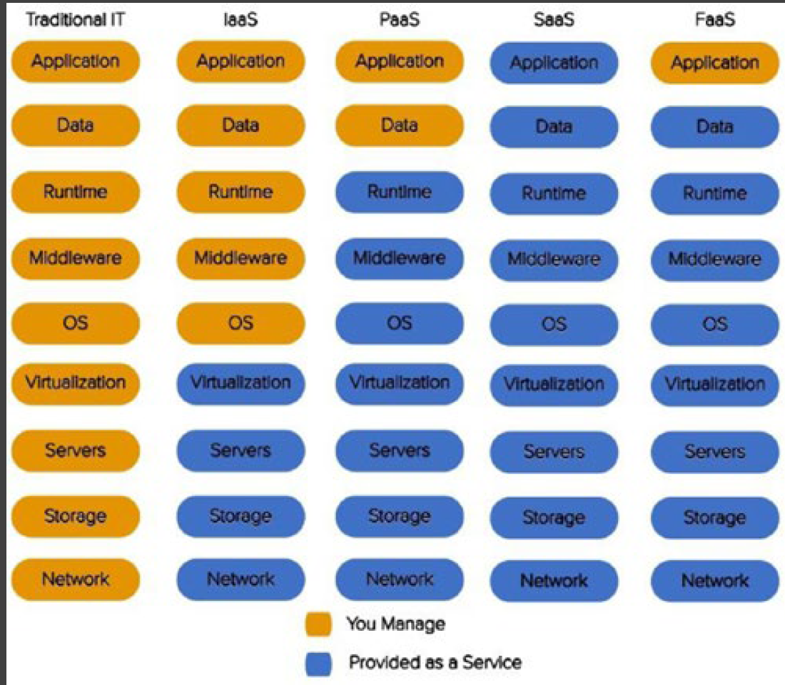

## FaaS (Function-as-a-Service).  
Serverless
[what-is-serverless](https://www.redhat.com/fr/topics/cloud-native-apps/what-is-serverless)

serverless computing = event-driven FaaS

[podcast](https://www.redhat.com/en/command-line-heroes/season-2/at-your-serverless)

[article amazon](https://www.primevideotech.com/video-streaming/scaling-up-the-prime-video-audio-video-monitoring-service-and-reducing-costs-by-90)

[analyse de devto](https://dev.to/indika_wimalasuriya/amazon-prime-videos-90-cost-reduction-throuh-moving-to-monolithic-k4a)

[Serverless framework](https://www.serverless.com/) and SST 

[check the video and comments to learn more about performance about Lambda](https://www.youtube.com/watch?v=7l3H6iY8Obg)
https://changelog.com/jsparty/294

## IAAS (infra as a service)
IaaS provides you with computing infrastructure, physical or virtual machines and other resources like virtual-machine disk image library, block, and file-based storage, firewalls, load balancers, IP addresses, and virtual local area networks. An example of this is an Amazon Elastic Compute Cloud (EC2) instance.

## PaaS (Platform-as-a-Service)
PaaS provides you with computing platforms which typically includes the operating system, programming language execution environment, database, and web server. Some examples include AWS Elastic Beanstalk, Azure Web Apps, and Heroku

## BaaS (Backend-as-a-Service) 

## SaaS (Software-as-a-Service) 

DaaS (Desktop-as-a-Service) 
CaaS (Containers-as-a-Service) 
MaaS (Monitoring-as-a-Service) 
NaaS (Network-as-a-Service)
SECaaS (Security-as-a-Service)
STaaS (Storage-as-a-Service)

## Node JS

Performance

https://changelog.com/jsparty/294

Node.js – okay, the problem with performance is who is pushing right now a lot of investment in software development, open source but also everything else? Cloud computing companies. One way or another we are all tied to Amazon, Google or Microsoft, or GitHub, or whatever, that are investing in some of our technologies and providing funds, in various ways. I’m not saying it’s a direct thing, but they have their own cloud products, and they are pushing these now. Now, the surge of serverless and a lot of other pay by millisecond thing, pay by consume, has made it absolutely damaging for those companies to invest even one dime in performance.

So AWS has gone so good length in trying to frame the narrative to get more and more of your money. Because you know, Node.js is asynchronous, can run multiple requests at the same time, with great speed, right?

You can do the same thing with others languages, by the way. You can run event-based computation on Ruby and Python; it doesn’t matter. It’s the same logic. So you have languages that are capable of running multiple requests, a lot of them actually, thousands, on the same process. Most of our apps literally take some data from a database and send it out. So when one database query is running, I can definitely send another one down the line, because my CPU and memory are basically idling there.

Now, so Node.js made a huge splash, because it was asynchronous, and it was able to handle thousands of concurrent requests from a single tiny node process. Even a tiny Raspberry Pi can run hundreds of concurrent requests on most things. Now, AWS convinced everybody that running more than one request at a time per process was wrong. And they have you pay per second, even when that CPU is idle. This is AWS Lambda. So if you use AWS Lambda, you’re paying even if your CPU is literally doing nothing. And everybody is believing in this massive lie, essentially, that that is a better model. It’s better for them. You need to know the trade-offs.

Lambdas are great at low volume, because they scale to zero and start very fast in the generic scheme of things. Try running a lot of Lambdas and then check your AWS bill. You’re going to be hit pretty heavily down if you have a lot of Lambda calls. Or even worse, you know that there is a massive amount of limit of how many Lambdas you can spawn on a single AWS account?

I think by default it’s 256. So at maximum you can handle 256 concurrent requests on the default account. You need to raise it, or something? And if you run out, then they start getting queued. And in the same time, you can – oh, wait a second, I can spawn 10,000 Lambdas. Okay, wait a second… I can run 10,000 concurrent requests on a single machine on Fargate, and it’s significantly better performant… But, very interesting, they don’t ship scale to zero on Fargate. Sorry, I’m just calling out the AWS bad marketing strategy to sabotage the industry, but that’s to make more money, which is great for them.

## SSR

