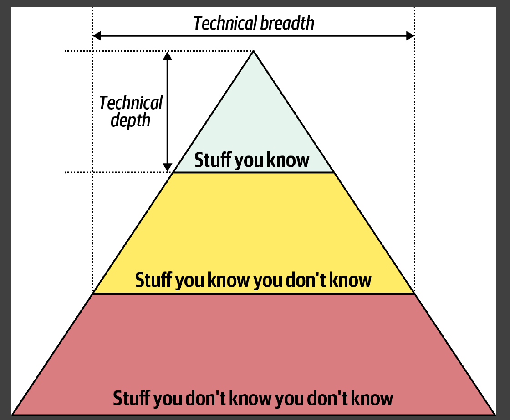

# Architectural Thinking

## Architecture Versus Design 23

## Technical Breadth 25

## Analyzing Trade-Offs 30

Architecture is the stuff you can’t Google.

It depends on the deployment environment,
business drivers, company culture, budgets, timeframes, developer skill set, and
dozens of other factors.

- Understanding Business Drivers 34
- Balancing Architecture and Hands-On Coding 34

1. Describe the traditional approach of architecture versus development and
explain why that approach no longer works.
2. List the three levels of knowledge in the knowledge triangle and provide an
example of each.
3. Why is it more important for an architect to focus on technical breadth rather than technical depth?
4. What are some of the ways of maintaining your technical depth and remaining hands-on as an architect?