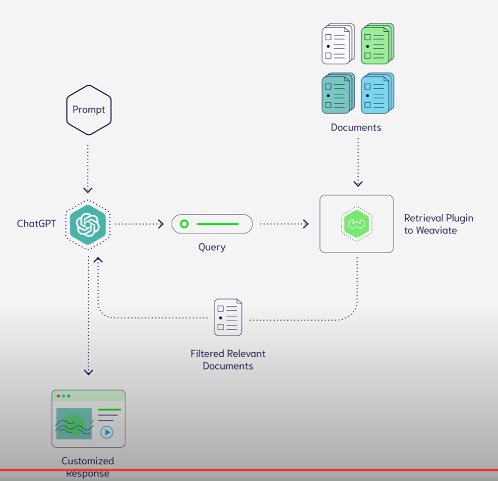

# Diagramming and Presenting Architecture

## Diagramming 316

Building very ephemeral design artifacts early prevents architects from becoming overly attached to what they have created, an anti-pattern we named *Building very ephemeral design artifacts early prevents architects from becoming overly attached to what they have created, an anti-pattern we named the **Irrational Artifact Attachment anti-pattern**

Tools 316

## Diagramming Standards: UML, C4, and ArchiMate 318

C4 : Context / Component / Container / Class

C4 is best suited for monolithic architectures where the container and component relationships may dif‐fer, and it’s less suited to distributed architectures, such as microservices.

Diagram Guidelines 319
Presenting 321
Manipulating Time 321
Incremental Builds 322
Infodecks Versus Presentations 324
Slides Are Half of the Story 324
Invisibility 324

# eraser.io

https://vimeo.com/user132791655

# More scemas with cool icons

