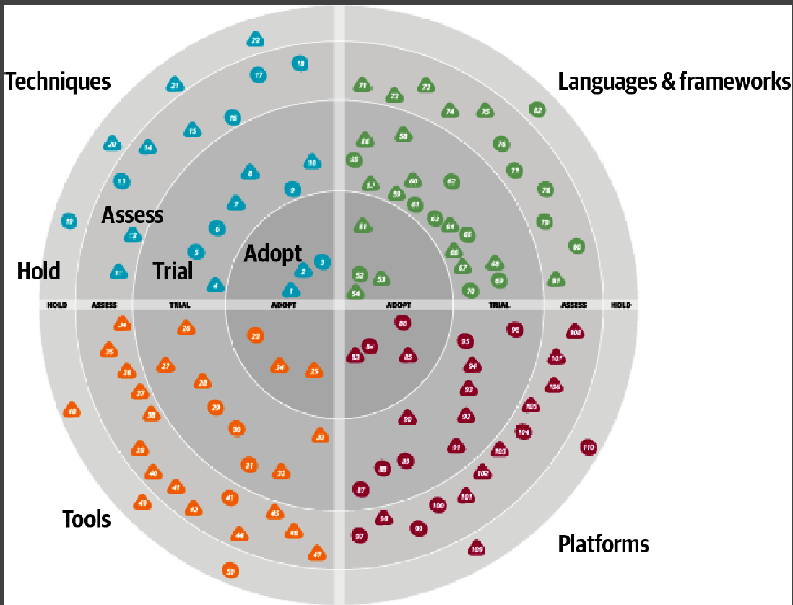

## Source

https://www.infoq.com/
https://dzone.com/refcardz

https://github.com/G33kzD3n/Catalogue

## technology radar

https://www.thoughtworks.com/radar



## Design System
https://www.thoughtworks.com/radar/techniques/design-system-decision-records

##  Design System Decisions

Architecture Description Records (ADRs) 
[capturing Design System decisions](https://zeroheight.com/blog/capturing-your-design-system-decisions/)

## gitflow vs trunk-based
https://www.atlassian.com/continuous-delivery/continuous-integration/trunk-based-development

## YAGNI : You ain't gonna need it

Don't overengineer

## scaling

### vertical or horizontal

### State or Stateless 

### Cap theorem

for DB

Which consistency Level ?
- Strict consistency : any write immediately available for all users
- eventual consistency : delay between the write and availability

Le théorème CAP (Consistency, Availability, Partition tolerance) est un concept clé en informatique distribuée qui met en avant les limitations des systèmes distribués. Selon ce théorème, un système distribué ne peut garantir simultanément les trois propriétés suivantes :

1. **Consistency (Consistance)** : Toutes les parties du système voient les mêmes données au même moment. En d'autres termes, chaque lecture sur le système renverra le même résultat, indépendamment de l'endroit où cette lecture est effectuée.

2. **Availability (Disponibilité)** : Chaque requête (lecture ou écriture) reçoit une réponse, sans garantie que celle-ci contient les données les plus récentes ou les plus cohérentes. En d'autres termes, le système répond même si certaines parties de celui-ci sont en panne.

3. **Partition tolerance (Tolérance aux partitions)** : Le système continue de fonctionner même si des messages sont perdus ou si les nœuds du système sont séparés en plusieurs groupes incapables de communiquer les uns avec les autres (c'est-à-dire en cas de panne réseau).

Lorsque l'on parle d'**"eventual consistency" (consistance éventuelle)**, on se réfère à la capacité d'un système distribué à garantir la cohérence des données à long terme, même s'il peut y avoir des retards temporaires dans la propagation des mises à jour à travers le système. En d'autres termes, le système peut subir des incohérences temporaires, mais finira par atteindre un état cohérent à mesure que les mises à jour se propagent à travers le système.

Ce modèle de consistance est souvent utilisé dans les systèmes distribués où la disponibilité et la tolérance aux partitions sont des priorités, comme les systèmes de bases de données NoSQL. Ces systèmes préfèrent offrir une disponibilité continue même en cas de perte de cohérence momentanée entre les nœuds, et la cohérence des données est garantie à long terme à mesure que le système se rétablit après une partition réseau ou une panne.


Reads vs Writes

Next / https://www.youtube.com/watch?v=gxfERVP18-g&list=PL4JxLacgYgqTgS8qQPC17fM-NWMTr5GW6&index=2


### horizontal scaling

Sharding or replication

Data sharding (split data between country)

Sharding by hash (for user id)


## Event Sourcing

CQRS / split read & write

## NoSQL

Non-Relational databases 

Popular ones are CouchDB,  Neo4j, Cassandra, HBase, Amazon DynamoDB 

These databases are grouped into four categories: 

- key-value stores
- graph stores 
- column stores
- document stores. 

Join operations are generally not supported in non-relational databases

Non-relational databases might be the right choice if:

• Your application requires super-low latency.
• Your data are unstructured, or you do not have any relational data.
• You only need to serialize and deserialize data (JSON, XML, YAML, etc.).
• You need to store a massive amount of data.

## DB replication 


## DB replication with django

https://docs.djangoproject.com/en/4.2/topics/db/multi-db/
https://earthly.dev/blog/set-up-postgresql-db/

Folowing code from chtgpt3.5 :

```python
# settings.py
DATABASES = {
    'default': {
        'ENGINE': 'django.db.backends.postgresql',
        'NAME': 'mydatabase',
        'USER': 'mydatabaseuser',
        'PASSWORD': 'mypassword',
        'HOST': 'localhost',
        'PORT': '5432',
    },
    'replica': {
        'ENGINE': 'django.db.backends.postgresql',
        'NAME': 'mydatabase',
        'USER': 'mydatabaseuser',
        'PASSWORD': 'mypassword',
        'HOST': 'replica-host',
        'PORT': '5432',
    }
}
DATABASE_ROUTERS = ['myproject.routers.ReplicationRouter']


# routers.py
class ReplicationRouter:
    def db_for_read(self, model, **hints):
        if model._meta.app_label == 'myapp':
            return 'replica'
        return 'default'

    def db_for_write(self, model, **hints):
        if model._meta.app_label == 'myapp':
            return 'default'
        return 'default'

    def allow_relation(self, obj1, obj2, **hints):
        return True

    def allow_migrate(self, db, app_label, model_name=None, **hints):
        return True

# view
from django.db import connections

def my_view(request):
    with connections['replica'].cursor() as cursor:
        cursor.execute('SELECT * FROM mytable')
        results = cursor.fetchall()
    # Utilisez les résultats de la réplication ici


```

## agile is dead

from [agile is dead](https://www.youtube.com/watch?v=WSflPE_oIRI)

### basic solution
"if we only paid attention to each other as human beings and worked small and did things iteratively [...] we don't need any of this agile stuff...".

### self management
My first understanding was that Agile/Scrum is a way to allow developers to sort of manage themselves, with acknowledgement that they can't get away from management completely and therefore tack on the idea of accountability to make it fit in a business context. But instead it has become a way for the business to micromanage developers. Agile/Scrum, I thought, was a way to identify work that is blocked or not working, and to fix it as a group. But In my experience it was not always done with the right attitude. Agile/scrum techniques are meant to quickly identify developer problems. Since everybody is different, all developers have different abilities. And so developer problems can also look like problem developers; problematic or underperforming developers. It can put rockstar developers on a pedestal, since they are responsible for making the burn down charts look good, and incentivizes those developers to look out for themselves. 

### bug-driven development
Instead, you have to have the right attitude, so that solving problems as a group means working with the group that you have. If you don't do that, it incentivizes developers to cut corners, in order to make artificial deadlines, and so you end up with bug-driven development instead of high quality code. The same goes for deadlines, where strict adherence to deadlines incentivizes mediocre developers to avoid taking the time to build in quality, and to cut corners instead, since only the top performers can be safely transparent.

### I've seen 

grown adults cry during stand ups, and retrospectives devolve into finger pointing, name calling, and even chair throwing.


### Competence

I think the root problem is one of competence.  If you have a small group of highly talented engineers who work well together then almost any process will work.  So you have very skilled people defining a light weight iterative process and some basic principles as “agile.”   Then you have a mass of management and mediocre software developers trying to apply concepts that, while simple, they don’t fully appreciate.   Most software developers think they are great.  Not everyone can be the best.  The majority are simply code monkeys.  The folks who defined agile originally are probably all really smart.  Often smart people underestimate their own ability and drastically overestimate the ability of the average software developer.


### underlying organizational problems
 Almost all the Scrum hate I've witnessed first hand has, upon deeper probing, been frustration with how Scrum exposed underlying organizational problems that needed addressing regardless of what framework we used.

### a methodology primarily for management 
 The problem I've seen with Agile (particularly in larger business) is that it's a methodology primarily for management, not for software engineers. Software engineers become disempowered under layers of middle management ceremony, and product owners are often so far removed from the actual production of the software that they equally become disempowered. This leads to a true lack of actual ownership and quality assurance yet it looks good and sensible from a line management point of view (and there are lovely graphs!) so it's the defacto tool of choice for big tech brother. Nobody uses it on smaller more passionate projects which are often far superior in quality, as they actually care about what they're doing.