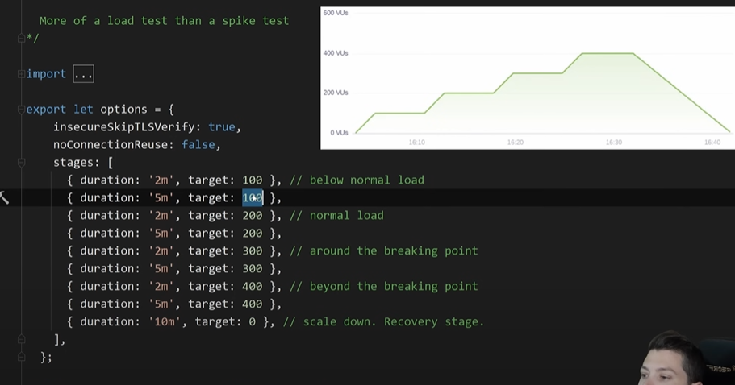
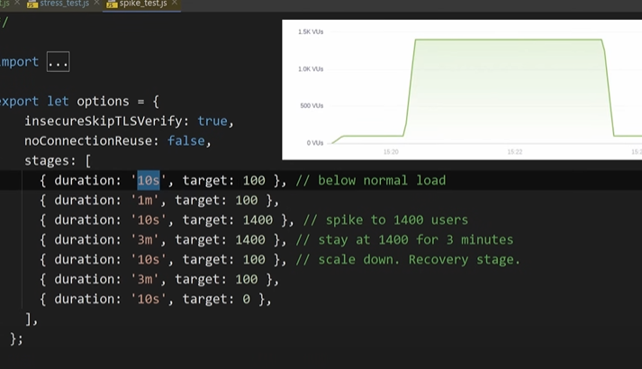
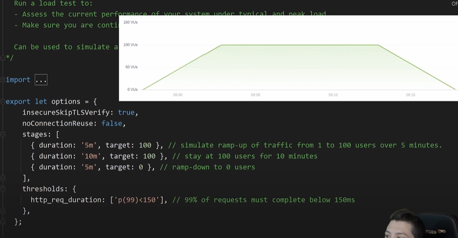
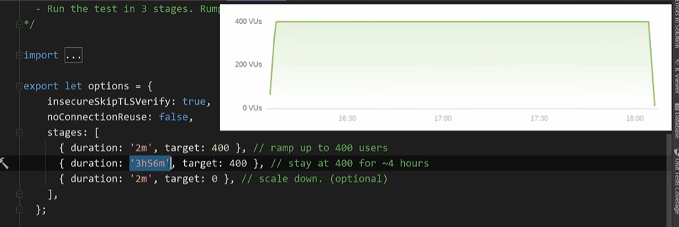

## K6

k6 run stress_test.js

[youtube](https://www.youtube.com/watch?v=r-Jte8Y8zag)

## stress testing
limit of the system

## Spike testing /
variation of a stress test (spiking to extreme load over a very short window of time)

## load testing / 

assessing the current performance of the system in terms of concurrent users or request per second

99% if requests must complete below 150ms

## Soak testing /

used to validate reliability of the system over a long time

## more tests

Tests de charge : Utilisez des outils de test de charge tels que Apache JMeter, Siege, locust, ou wrk pour simuler un grand nombre d'utilisateurs accédant à votre application en même temps. Ces outils peuvent générer un trafic simulé et vous aider à identifier le point de rupture de votre application.

Monitoring système : Utilisez des outils de surveillance système tels que Nagios, Prometheus, Grafana, ou New Relic pour surveiller les ressources système de votre serveur (CPU, mémoire, utilisation du disque, etc.). Cela vous permettra d'identifier les éventuels goulots d'étranglement.

Analyse des journaux Django : Les journaux de Django peuvent également vous fournir des informations précieuses sur les performances de votre application. Assurez-vous d'activer les journaux appropriés et d'analyser les données générées.

Optimisation du code : Effectuez des analyses de profilage du code Django pour identifier les parties de votre application qui consomment le plus de ressources. Des outils tels que cProfile peuvent vous aider à identifier les fonctions les plus coûteuses en termes de performances.

Cache : Utilisez un système de mise en cache pour réduire la charge sur votre base de données et accélérer l'accès aux données fréquemment demandées.

Base de données : Optimisez les requêtes de base de données et utilisez des index appropriés pour améliorer les performances des requêtes.

Scaling : Si votre application continue de croître, envisagez d'adopter des solutions de mise à l'échelle telles que le déploiement sur plusieurs serveurs, l'utilisation d'un équilibreur de charge, ou l'utilisation de services cloud extensibles.

Surveillance en temps réel : Utilisez des outils de surveillance en temps réel pour obtenir des données sur les performances de votre application au fur et à mesure qu'elle fonctionne en production.