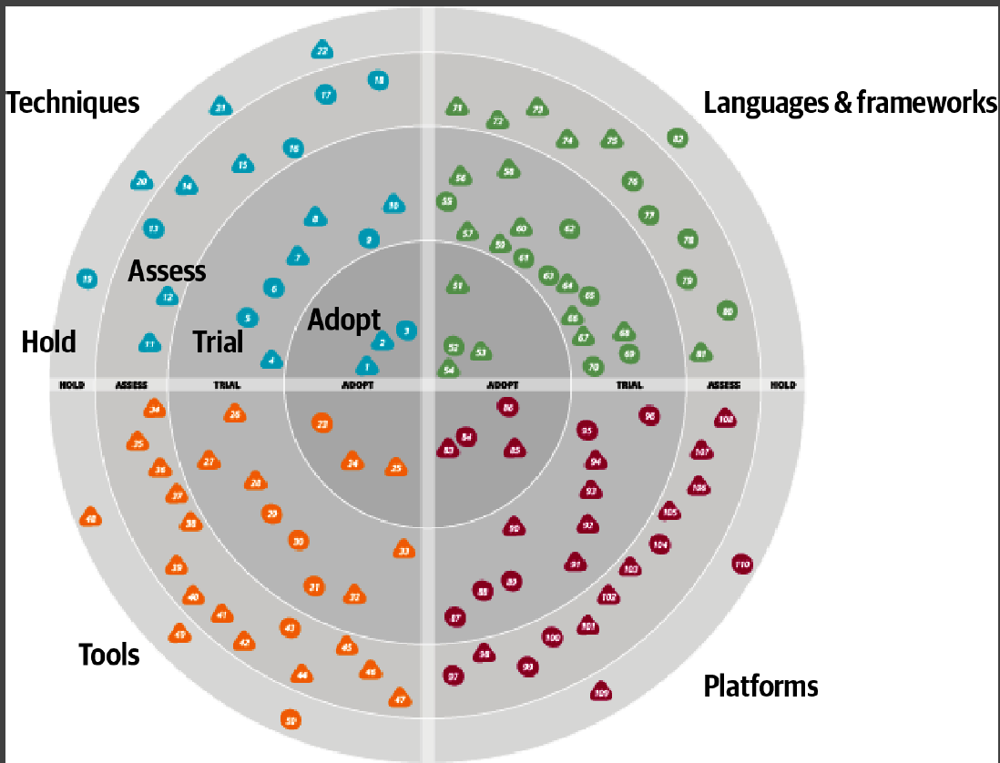

## Source

https://www.infoq.com/
https://dzone.com/refcardz
    

## technology radar

https://www.thoughtworks.com/radar

## Design System
https://www.thoughtworks.com/radar/techniques/design-system-decision-records

##  Design System Decisions

Architecture Description Records (ADRs) 
[capturing Design System decisions](https://zeroheight.com/blog/capturing-your-design-system-decisions/)

## giflow vs trunk-based
https://www.atlassian.com/continuous-delivery/continuous-integration/trunk-based-development