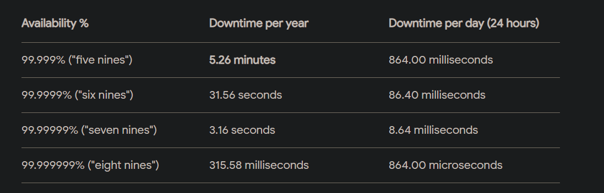

## The 7 Rs of Cloud Migration: 7 Strategies 

Rehost (“Lift and Shift”)
Relocate (“Hypervisor-Level Lift and Shift”)
Replatform (“Lift and Reshape”)
Refactor (“Re-architect”)
Repurchase (“Drop and Shop”)
Retire
Retain (“Revisit”)

## question : 

1. why do you want to move to cloud ?
- DC exit
- Latency problem
- performance issue
- using niche services / managed services
- improve upon HA

2. How much code change are you okay with ?
- complete re-dev [SQS, SNS, Aurora, S3, etc...]
- just minor configuration changes
- no changes at all [lift and Shift]

3. RTO/RPO req

RTO / recovery time objectives
RPO / recovery points objectives

- how much max downtime ?
- how much data can you loose ?
- cost contraints

4. Analysis of the existing
    - What load balancer are you using ?
        - CLB, ALB, NLB (Classic, Appication, Network...)
    - What os is there ?
    - what app server ?
    - DB ?
    - Public facing website
        - how do you filter malicious traffic ?
        - solution = WAF (web application filtering)
        - suggest cloudfront CDN service
        - reminder : load balancer is a managed service

5. Current sizing of the servers ?
    - no magic formula
    - load testing
    - cloudwatch metrics

6. workload variations
    - auto scaling groups

7. Is the application Stateful or Stateless ?
    - not storing session informations on app server 
    - store in external db (fast rds, dynamo, elasticache )
    - no need to enable session stickiness

7. Current backup strategy
    - retention policy
    - rds automatic backup
        - retention period
        - automation - manual snapshots
    - AMI 

7. Logs
    - push the logs to S3 or cloudwatch logs (>> search patterns for error codes & create alarms over customer metrics )
    - lifecycle policy

8. Monitoring of the app ? Req ?

## Step 2

1. identifiy complexity & security risk
2. determine priority & dependencies
3. Adress EOL & EOS / End of Life & End of Support
4. provide cloud consumption cost analysis

+data record management requirements dictated by law in Healthcare, Financial Services,

## Step 3 / Equipment valuation

Data center Buyout program

- Inventory of customers servers
- Appraise value of equipment
- Competitive buyout offer

## Step 4 / Workload Mapping

Migration mapping based on assesment
Map out workload migration
Financial solution during the process

## Step 5 / Cloud Migration

Complete backup of customers workload
Performing migration

## Step 6 / Data Center Decommissioning

Securely sanitize data

## Step 7 / Ongoing management & optimization

## « Golden Signals »

La latence
Le trafic
La saturation des ressources
Le taux d’erreurs
