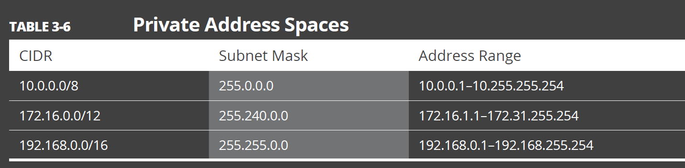

## Exemple avec Tehtris : partenaires distributeurs

"distribution partner" ou "distributor partner"

Arrow ECS est partenaire distributeur de Tehtris ainsi que :

Ignition Technology / Ignition Technology est un distributeur de sécurité pour le monde du SaaS. Il se repose sur un réseau de partenaires, pour permettre la transformation des entreprises et leur sécurisation via la commercialisation de solutions de cybersécurité innovantes et émergentes.

UGAP / Les offres de TEHTRIS sont référencées au sein du catalogue de l’UGAP (Union des groupements d’achats publics) dans la partie logiciels multi-éditeurs qui est mis à disposition de tous les acheteurs publics.

## Cloud Distribution partner

[Find the right Google Cloud partner](https://cloud.google.com/find-a-partner/?products=Chrome&location=france)

[Microsoft](https://partner.microsoft.com/fr-fr/partnership/cloud-solution-provider/find-a-provider#)

    ALSO France S.A.S.
    AppXite / As the cloud becomes mainstream, the distributor’s purpose shifted from distribution to aggregation. The successful cloud aggregators of today are able to add meaningful value to their channels and help them navigate the constantly changing cloud market.
    
    Arrow ECS France SAS -> https://www.arrow.com/globalecs/fr/produits/microsoft/ : 404 - Page non trouvée
  
    Be Cloud Distri
    CRAYON
    Ingram Micro
    Lenovo (France) SAS
    Pax8
    QBS Group
    Sewan
    SoftwareONE France SAS 
    Tech Data France S.A.S.

[AWs](https://partners.amazonaws.com/search/partners/?keyword=arrow&loc=PARIS)

Arrow is a technology enablement company that brings innovative IT solutions to solve complex business challenges. We deliver cloud value-added distribution, business consulting and channel enablement services to technology manufacturers and channel partners, we help to optimize the cloud spend; guide on building competencies; design support to ensure smooth migrations to cloud and lead generation

https://partners.amazonaws.com/partners/001E000000pb2kvIAA/Arrow

https://play-your-ace.cloud/2019/02/04/aws-on-arrowsphere/

https://www.youtube.com/@arrowfrance2955/videos

https://www.ibm.com/partnerplus/directory/company/3295

https://www.arrow.com/globalecs/fr/produits/ibm/

https://www.arrow.com/globalecs/fr/produits/

    - ArrowSphere
    - Artificial Intelligence
    - Cloud
    - Informatique
    - Data Management
    - Informatique edge
    - Réseau
    - IT industrielle
    - Sécurité / Tehtris n'est pas listé dans cette - catégorie
    - Stockage
    - Service de support
    - Virtualisation

No adobe, no ERP, no CRM ?

## cloud souverain

[Numspot lancement prévu 2024](https://www.lemondeinformatique.fr/actualites/lire-cloud-de-confiance-numspot-lancera-ses-offres-mi-2024-92300.html)

À ma connaissance en date de janvier 2022, Datadog et ArrowSphere sont deux plateformes qui offrent des services et des fonctionnalités différents dans le domaine de la gestion des données et des performances informatiques.

1. **Datadog** :
   - **Surveillance et Analyse des Performances :** Datadog se concentre sur la surveillance en temps réel des performances des applications, de l'infrastructure, des logs, et plus encore.
   - **Intégration avec Diverses Technologies :** Datadog propose des intégrations avec une variété de technologies, permettant aux utilisateurs de surveiller et d'analyser leurs applications dans des environnements variés.
   - **Tableaux de Bord et Alertes :** La plateforme fournit des tableaux de bord personnalisables et des alertes pour aider les équipes à identifier rapidement les problèmes de performances.

2. **ArrowSphere** :
   - **Plateforme de Gestion Cloud :** ArrowSphere offre une plateforme de gestion cloud qui peut inclure la gestion des licences logicielles, la facturation, et d'autres services liés à la gestion des ressources informatiques.
   - **Distribution de Logiciels et Services :** Il se concentre également sur la distribution de logiciels et de services à travers sa plateforme.
   - **Gestion des Ventes et Facturation :** ArrowSphere peut être utilisé pour gérer les ventes, la facturation et d'autres aspects liés à la distribution de logiciels et de services.

En résumé, Datadog se positionne davantage comme une plateforme de surveillance des performances, tandis qu'ArrowSphere se concentre sur la gestion globale des ressources informatiques, y compris la distribution de logiciels et de services. Cependant, les fonctionnalités exactes peuvent varier en fonction des évolutions ultérieures de ces plates-formes. Pour obtenir des informations plus récentes et spécifiques, il est recommandé de consulter les sites officiels des deux entreprises ou de contacter directement leurs équipes commerciales.

# Questions

## Q1

Extrait de [solutions cloud](https://www.arrow.com/globalecs/fr/solutions/cloud/)

Accédez aux produits qui s'étendent du data center, au cloud en passant par l'edge.
Ceci demande tout un écosystème de fournisseurs pour livrer les solutions multi-cloud hybrides. Nous avons des relations de longue date avec nos fournisseurs, ainsi qu’avec les principaux hyperscalers et cloud providers.

Accélérez votre croissance avec notre plateforme cloud
Tout doit être plus simple lorsque c’est un service. ArrowSphere rend cela possible. Notre plateforme de gestion cloud vous permet d’offrir depuis notre marketplace les solutions des meilleurs fournisseurs, mais aussi **d'autres fournisseurs que vous pouvez embarquer directement**, ainsi que vos propres produits et services. Gérez vos flux de travail. Consolidez votre facturation. Accédez à fonctions analytiques avancées. Le tout sur une seule plateforme.

Un portail personnalisable
Améliorez le service que vous offrez aux clients finaux grâce à notre portail MyCloud. Il s’agit d’un portail clé en main, personnalisé avec votre propre marque. Vous disposez d'un contrôle total sur ce que les utilisateurs peuvent y voir, y compris sur les règles de tarification et de promotion.

Une personnalisation accrue est possible grâce à notre kit de développement logiciel **(SDK) ou, si vous avez déjà une portail existant, vous pouvez utiliser nos API ouvertes pour l'interfacer avec ArrowSphere.**

Est-ce que par exemple un de vos clients pourraient proposer du Datadog ?

## Question 2

Quel impact le rachat de VMware par Broadcom ? Est-ce juste une modification de vos plans tarifaires ?

vSphere, vSAN et Cloud Foundation

1. **vSphere :** VMware vSphere est une plateforme de virtualisation complète qui permet de créer, gérer et optimiser des environnements informatiques virtualisés. Il offre des fonctionnalités de virtualisation des serveurs, du stockage et du réseau, facilitant la gestion des ressources informatiques et améliorant l'efficacité opérationnelle.

2. **vSAN (Virtual SAN) :** VMware vSAN est une solution de stockage hyperconvergée qui intègre le stockage directement dans l'infrastructure de virtualisation. Il permet de créer un stockage partagé et hautement disponible à partir des disques locaux des serveurs, simplifiant ainsi la gestion du stockage et améliorant les performances.

3. **Cloud Foundation :** VMware Cloud Foundation est une plateforme intégrée qui combine vSphere, vSAN et NSX pour fournir une infrastructure cloud complète et prête à l'emploi. Elle offre une gestion unifiée des ressources informatiques, des capacités de déploiement automatisé, et une évolutivité pour les environnements sur site, cloud privé et cloud public, facilitant ainsi la construction et la gestion d'architectures cloud hybrides.x²

## Question 3

Est-ce que vous proposer des services de migration clouds ?

## Question 4

Dans cette nouvelle équipe, est-ce qu'il y a des OKR / KPI de définis ? 

Est-ce qu'on traite du marketing inbound ou outbound ?

Est-ce qu'il faut produire du contenu ?

## Question 5

IAAS 
PAAS
HAAS
SAAS

Vous ne faites pas de FAAS car vous ne gérer pas la partie Data ?
Mais alors à quoi correspond dans votre offre produit : Data Management

## Question 6

Comment Arrow évalue la possibilité d'ajouter un vendor ? 

## Question 7

Pourquoi GCP n'est-il pas listé ?

## Question 8

Microsoft Cloud apparait mais pas Office 365

## Question 9

Est ce que vous pourriez vous définir comme un cloud broker, cloud aggregator ou cloud enabler

## Question 10

Cloud Aggregator & Cloud enabler

Certains d’entre eux vont encore plus loin, en fournissant à leurs clients des interfaces propriétaires permettant d’utiliser des services Cloud de multiples fournisseurs sans aucune difficulté comme s’ils étaient tous fournis par le même vendeur. On peut alors aussi parler d’un  » agrégateur de Cloud « .

Enfin, certains Cloud Brokers proposent des services supplémentaires à leurs clients tels que la duplication de données, le chiffrement, ou le transfert des données vers le Cloud. Ce type de Cloud Broker est aussi appelé parfois  » Cloud Enabler « .

## SLR [Security Lifecycle Review](https://docs.paloaltonetworks.com/cortex/security-lifecycle-review/security-lifecycle-review-getting-started/getting-started/what-is-slr)

PANW summary spec sheet

