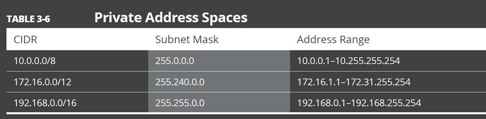

https://cidr.xyz/

## Adresses sans classe
Les adresses sans classe ou de routage inter-domaines sans classe (CIDR) utilisent le masque de sous-réseaux à longueur variable (VLSM, variable length subnet masking) pour modifier le rapport entre les bits d'adresse réseau et hôte dans une adresse IP. Un masque de sous-réseau est un ensemble d'identifiants qui renvoie la valeur de l'adresse réseau à partir de l'adresse IP en transformant l'adresse hôte en zéros. 

CIDR (Classless Inter-Domain Routing) est une méthode utilisée pour allouer et hiérarchiser les adresses IP de manière plus efficace que les anciens schémas de classes d'adresses IP. L'adresse IP que vous avez fournie, 192.168.1.0/28, peut être interprétée de la manière suivante :

1. **Adresse IP de réseau :** 192.168.1.0
2. **Préfixe CIDR :** /28
3. **Masque de sous-réseau en notation binaire :** 11111111.11111111.11111111.11110000

Maintenant, regardons ce que cela signifie en termes de block et de plage IP :

1. **Adresse IP de réseau :** 192.168.1.0
   - C'est l'adresse de début du bloc. Toutes les adresses IP dans le bloc commenceront par cette adresse.

2. **Préfixe CIDR :** /28
   - Cela signifie que les 28 premiers bits de l'adresse IP sont le réseau, et les 4 bits restants sont réservés pour les hôtes. En d'autres termes, il y a 2^4 = 16 adresses IP dans ce bloc.

3. **Plage d'adresses IP :** De 192.168.1.0 à 192.168.1.15
   - La plage d'adresses IP comprend toutes les adresses de 192.168.1.0 à 192.168.1.15, car il y a 16 adresses dans ce bloc (/28 signifie qu'il y a 2^(32-28) = 16 adresses).

4. **Masque de sous-réseau :** 255.255.255.240
   - En notation décimale pointée, le masque de sous-réseau est 255.255.255.240, ce qui correspond à /28 en notation CIDR. Cela signifie que les 28 premiers bits sont réservés pour le réseau, et les 4 derniers bits sont réservés pour les hôtes.

En résumé, l'adresse IP de réseau 192.168.1.0/28 représente un bloc d'adresses IP comprenant 16 adresses, de 192.168.1.0 à 192.168.1.15, avec un masque de sous-réseau de 255.255.255.240.

Et si l'adresse est 192 . 168 . 1 . 100

IP address : 11000000 10101000 00000001 01100100
Subnet mask: 11111111 11111111 11111111 11110000
Network ID: 11000000 10101000 00000001 01100000
192 . 168 . 1 . 96

Donc commence à 96 = 1100000

Et si le VLSM (variable length subnet masking) = 30
192.168.1.100/30
11000000 10101000 00000001 01100100
11111111 11111111 11111111 11111100
11000000 10101000 00000001 01100100

Donc commence à : 01100100 donc 100

D'après cgpt

Adresse IP du réseau : 192.168.1.100
Adresse IP broadcast : 192.168.1.103 (c'est l'adresse du réseau + 3)
Adresse IP du premier hôte : 192.168.1.101
Adresse IP du dernier hôte : 192.168.1.102

## Public vs Private adresses
see page 152

10.0.0.0/24
00001010.00000000.00000000.00000000
11111111.11111111.11111111.00000000

cela représente 10.0.0.0 à 10.0.0.255

10.0.2.0/23
00001010.00000000.00000010.00000000
11111111.11111111.11111110.00000000

cela représente 10.0.2.0 à 10.0.3.255
