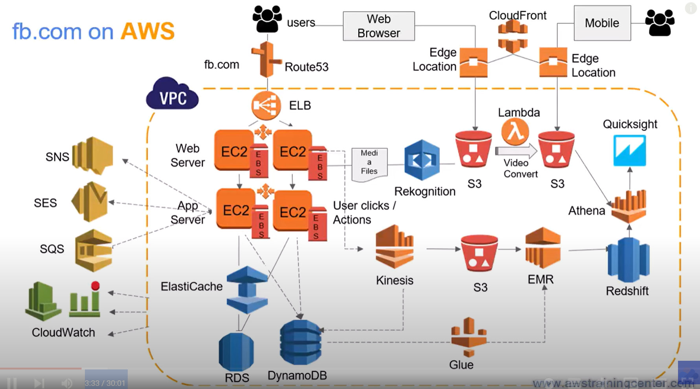

[course AWS](https://www.youtube.com/watch?v=XZbvQWkpJTI)

## Let's start

Secure but not reliable

Better solution with direct connect partner (or on your own)

need openVPN server client for the remote workers

VPC peering is non transitive : needs 1 to 1 connection

To remedy that :

Advanced topics of VPC : vpc endpoint services

could be a problem (if NAT goes down or for secured reasons)

VPC endpoint gateway to reach S3 or DynamoDB

if we want to use more services : 

So it creates ENI Elastic Network interface inside the subnet

If we subscribe to SAAS services and if all VPCs are inside AWS : we can use Private Link

