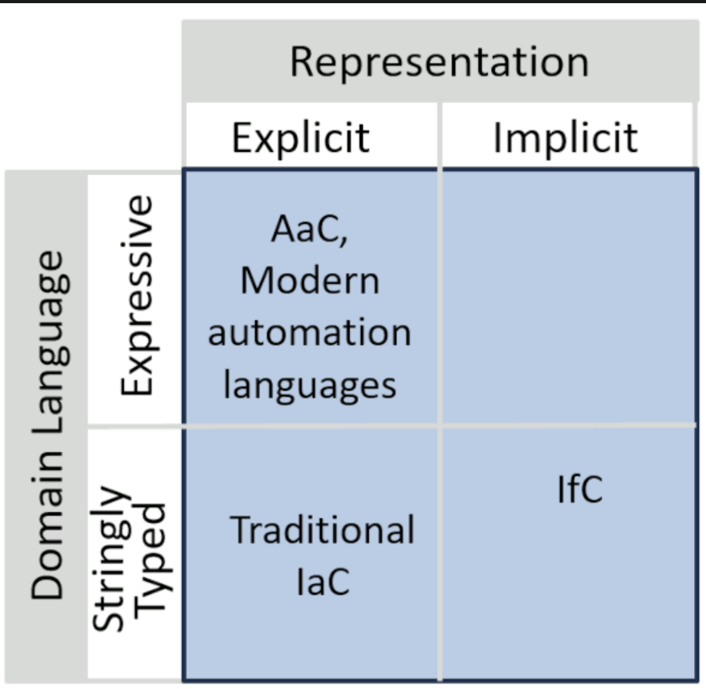

it starts from the Gregor Hohpe's blog : 

https://architectelevator.com/cloud/iac-ifc-trends/

with this diagram :

quote : "a cloud compiler might be better at optimizing your costs than you would, just like a code compiler likely generates faster assembly code"

Some books :

[infra as code](https://www.amazon.com/Infrastructure-Code-Dynamic-Systems-Cloud/dp/1098114671?)

[learning domain driven design](https://www.amazon.com/dp/1098100131)

Some web links :

[Infrastructure-from-Code vs Infrastructure-as-Code](https://serverlessfirst.com/emails/infrastructure-from-code-vs-infrastructure-as-code/)

[infra from code](https://infrastructurefromcode.com/)

[enterprise integration pattern](https://www.enterpriseintegrationpatterns.com/patterns/messaging/PublishSubscribeChannel.html)

[eventual](https://docs.eventual.ai/what-is-eventual)

Additional Reading
[The Current State of Infrastructure From Code by Allen Helton](https://www.readysetcloud.io/blog/allen.helton/infrastructure-from-code-benchmark/)
[The Self Provisioning Runtime by Shawn "swyx" Wang](https://www.swyx.io/self-provisioning-runtime)
[Infrastructure-from-Code vs Infrastructure-as-Code by Paul Swail](https://serverlessfirst.com/emails/infrastructure-from-code-vs-infrastructure-as-code/)
[The future of cloud development by Jeremy Daly](https://www.getampt.com/blog/introducing-ampt/)
[▶️ AWS re:Invent 2022 - Unleash developer productivity with infrastructure from code (COM301) by Jeremy Daly](https://www.youtube.com/watch?v=RmwKBPCo7o4)
[What Does The Future Hold For Serverless? by Allen Helton](https://www.readysetcloud.io/blog/allen.helton/what-does-the-future-hold-for-serverless/)
[Overcoming Infrastructure as Code obstacles: It's time for Infrastructure from Code by Asher Sterkin](https://www.idgconnect.com/article/3647074/overcoming-infrastructure-as-code-obstacles-its-time-for-infrastructure-from-code.html)