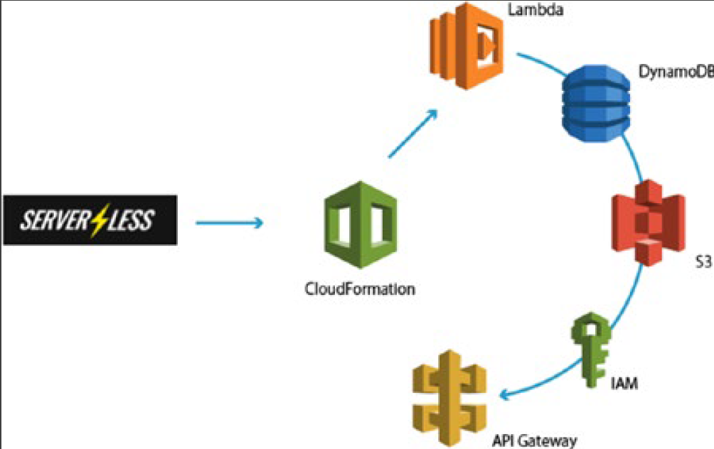

| AWS Lambda | Azure Functions | Google Cloud Functions |
| --- | ---| ---|
| First million requests a month free | First million requests a month free | First 2 million requests a month free |
| $0.20 per million requests afterwards | $0.20 per million requests afterwards | $0.40 per million requests afterwards
| $0.00001667 for every GB-second used | $0.000016 for every GB-second used | $0.000025 for every GB-second used


## [Serverless Framework](https://www.serverless.com/#How-It-works)

https://github.com/serverless/serverless

open source application framework that lets easily build serverless architectures



    npm install –g serverless   

## AWSJavaScriptSDK

    var AWS = require('aws-sdk');

You can then access the various AWS resources using the AWS variable you created and the API
reference materials that can be found here:
https://docs.aws.amazon.com/AWSJavaScriptSDK/latest/index.html
This documentation will show you how to create and access particular services. The following example
code shows how you can create a table in DynamoDB using the AWS SDK.

```js
"use strict";
Object.defineProperty(exports, "__esModule", { value: true });
var AWS = require("aws-sdk");
module.exports.CreateTable = (event, context, callback) => {
  var dynamodb = new AWS.DynamoDB();
  var docClient = new AWS.DynamoDB.DocumentClient();
  var params = {
    TableName: process.env.TABLE_NAME,
    KeySchema: [
      { AttributeName: "LastName", KeyType: "HASH" }, //Partition key
    ],
    AttributeDefinitions: [{ AttributeName: "LastName", AttributeType: "S" }],
    ProvisionedThroughput: {
      ReadCapacityUnits: 10,
      WriteCapacityUnits: 10,
    },
  };
  dynamodb.createTable(params, function (err, data) {
    if (err) {
      console.error(
        "Unable to create table. Error JSON:",
        JSON.stringify(err, null, 2)
      );
    } else {
      console.log(
        "Created table. Table description JSON:",
        JSON.stringify(data, null, 2)
      );
    }
  });
};
```

## AWS CLI

    pip install --upgrade --user awscli.

Once the CLI is installed you can configure your AWS CLI account using the command:

    aws configure

The documentation for this can be found at 
http://docs.aws.amazon.com/cli/latest/userguide/installing.html