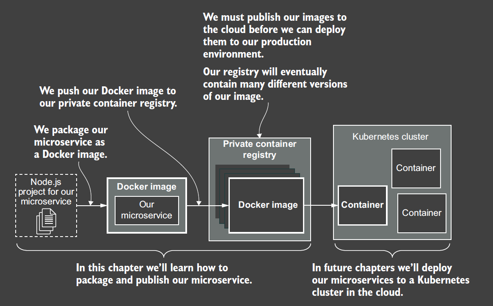

#start

```js
const express = require("express");
const fs = require("fs");
const app = express();
const port = 3000;
app.get("/video", (req, res) => {
  const path = "../videos/SampleVideo_1280x720_1mb.mp4";
  fs.stat(path, (err, stats) => {
    if (err) {
      console.error("An error occurred");
      res.sendStatus(500);
      return;
    }
    res.writeHead(200, {
      "Content-Length": stats.size,
      "Content-Type": "video/mp4",
    });
    fs.createReadStream(path).pipe(res);
  });
});
app.listen(port, () => {
  console.log(`Example app listening on port ${port}!`);
});

```

### 2.6.6 Configuring our microservice

```JS
const express = require("express");
const fs = require("fs");
const app = express();
if (!process.env.PORT) {
  throw new Error(
    "Please specify the port number for the HTTP server with the environment variable PORT."
  );
}
const PORT = process.env.PORT;
// ... code omitted for brevity ...
app.listen(PORT, () => {
  console.log(`Service listening on port ${PORT}!`);
});
```

On Linux and MacOS, we’ll set it using this command:

    export PORT=3000
If working on Windows, do this instead:

    set PORT=3000

### 2.6.7

    npm install --only=production

Add some items in package.json for "npm start"

```JSON
{
"name": "example-1",
"version": "1.0.0",
"description": "",
"main": "index.js",
"scripts": {
"start": "node index.js"
},
"keywords": [],
"author": "",
"license": "ISC",
"dependencies": {
    "express": "^4.17.1"
    }
}
```

Live Reloading :

    npm install --save-dev nodemon

then we replace node with nodemon : 

    npx nodemon index.js

This is a useful command that comes with Node.js and allows us to run installed dependencies from the command line

update package.json

```json
{
"name": "example-3",
"version": "1.0.0",
"description": "",
"main": "index.js",
"scripts": {
    "start": "node index.js",
    "start:dev": "nodemon index.js"
    },
"keywords": [],
"author": "",
"license": "ISC",
"dependencies": {
    "express": "^4.17.1"
    },
"devDependencies": {
    "nodemon": "^2.0.4"
    }
}
```

Now that we have defined the start:dev command, we can run our microservice in development mode like this:

    npm run start:dev

We can omit the run part for npm start and npm test (which we will learn about in chapter 8) because npm has special support for these particular conventions.

# 3. publishing first micro services


Docker is open source and you can find the code for the CLI tool here:
    
    https://github.com/docker/cli
You can see other open-source projects from the makers of Docker here:
    
    https://www.docker.com/community/open-source




Docker File

```
FROM node:12.18.1-alpine
WORKDIR /usr/src/app
COPY package*.json ./
RUN npm install --only=production
# copy the source code
COPY ./src ./src 
COPY ./videos ./videos
CMD npm start
```

the Docker build command packages our microservice in a docker image

    docker build -t video-streaming --file Dockerfile .

docker build -t < your-name-for-the-image > --file < path-to-your-Dockerfile > < path-to-project >

Result :

    Successfully built 9c475d6b1dc8
    Successfully tagged video-streaming:latest

Check :

    docker image list

Use the docker run command to instantiate it as a container

    docker run -d -p 3000:3000 video-streaming

Binds container port 3000 to host port 3000
docker run -d p < host-port >:< container-port > < image-name >

check :

    docker contrainer list  

CONTAINER ID IMAGE STATUS PORTS
460a19946689 video-streaming Up 20 seconds 0.0.0.0:3000->3000/tcp

Let’s check the output of the microservice and see what it tells us:

    docker logs < container id >

## 3.9 pushing the micro services

AUTHENTICATING WITH THE REGISTRY

    docker login <your-registry-url> --username <your-username> --password <your-password>

TAGGING OUR IMAGE

    docker tag video-streaming bmdk1.azurecr.io/video-streaming:latest
    docker tag <existing-image> <registry-url>/<image-name>:<version>

PUSHING OUR IMAGE TO THE REGISTRY

    docker push bmdk1.azurecr.io/video-streaming:latest
    docker push <registry-url>/<image-name>:<version>

REMOVING OLD CONTAINER

Before we can test our image from the registry, there’s one thing standing in our way. We must first remove the local versions of our image. We have to do this; otherwise, when we invoke docker run, it will boot the container from the local version of the image that we already have.

    docker ps
    docker kill <container id>
    docker rm <container id>
    docker image list
    docker rmi <image id> --force
    docker run -d -p 3000:3000 bmdk1.azurecr.io/video-streaming:latest

# 4 Data management for microservices

see chapter-4 folder

    docker-compose up --build

New terminal

    docker-compose ps

stop option 1

    docker-compose stop
stop option 2

    ctrl+C

stop option 3

    docker-compose down

restart

    docker-compose down && docker-compose up --build

Shell script

down.sh for docker-compose down
reboot.sh for docker-compose down && docker-compose up --build

## 4.4 Adding file storage to our application

here
