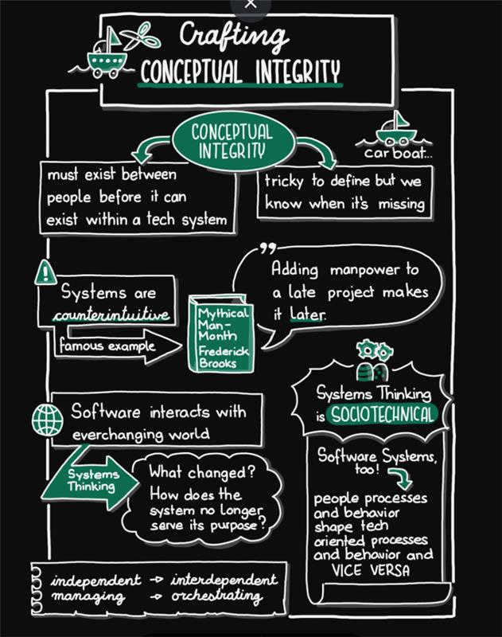
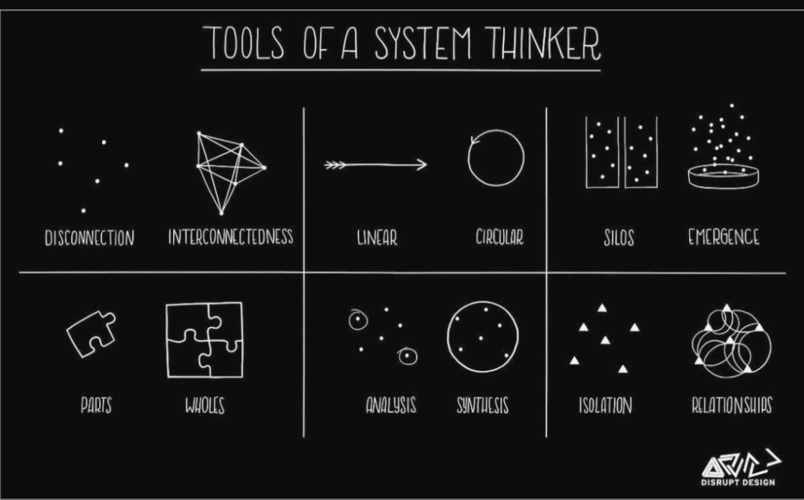
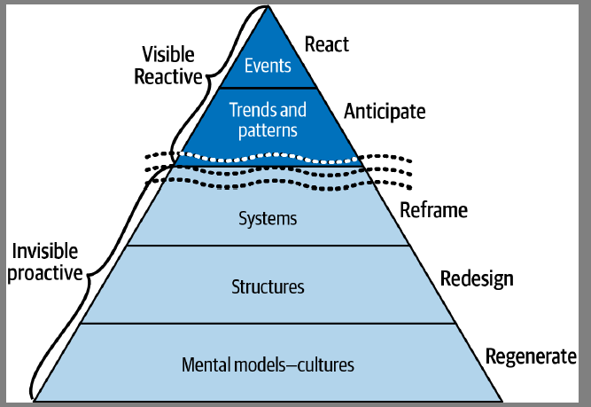

# Part 1

## Chapter 1

https://en.wikipedia.org/wiki/Rube_Goldberg_machine
 
Quandary / Dilemne
 
There are no “12 Steps to Systems Thinking and the First One Will Surprise You!” listicles that will teach you everything you need to know in 10 minutes. There are no systems thinking whiteboard tests to pass or certification exams. You never finish learning about systems; they will teach you forever.
 
Recognize the difference between reductionistic, analytical thinking (linear) and taking a systemic perspective (nonlinear). Discern when to apply one or the other (or both).
 
Conceptual integrity is the most important consideration in system design.
 
As Conway’s Law states, “Organizations, who design systems, are constrained to produce designs which are copies of the communication structures of these organizations.”
 

## Chapter 2

### Systems Thinking Is Sociotechnical

### Time is always a factor
Even when a team tries to “manage” complexity by building a fortress surrounded by
a moat filled with crocodiles to protect the boundaries of their software, that team is
still part of a sociotechnical system. A system that includes crocodiles. The software is
still part of a system. We still need to understand how the people, and the software,
are interdependent. (And understand why we are building fortresses.)

## Chatper 3 : Shifting your perspective

# Part 2 : You are a system thinking

## Chapter 4 : Self awareness as a Foundational Skill

## chapter 5 : Replace reacting with responding

Reactions are recursive. We have a reaction, and we react to our reaction and react to our reaction to the reaction…this is a highly combustible process.

While it can be fun to debate opinions, when it comes to systems thinking, being opinion-driven has its downsides: We debate dualities.

We want to be right, and we want people to agree that we are right. This is antithetical to systems thinking, where we want to learn and grow.

Opinion-driven discussions don’t usually focus on understanding the complexity inherent in each context

## chapter 6 : A system of learning

Inference is reaching a conclusion based on reasoning and evidence.

Argumentation is not arguing

Your own ideas about how the world should be come through in emotionally
loaded overtones (this is a form of bias). “Agile is a steaming pile of garbage
dumped into JIRA.”

