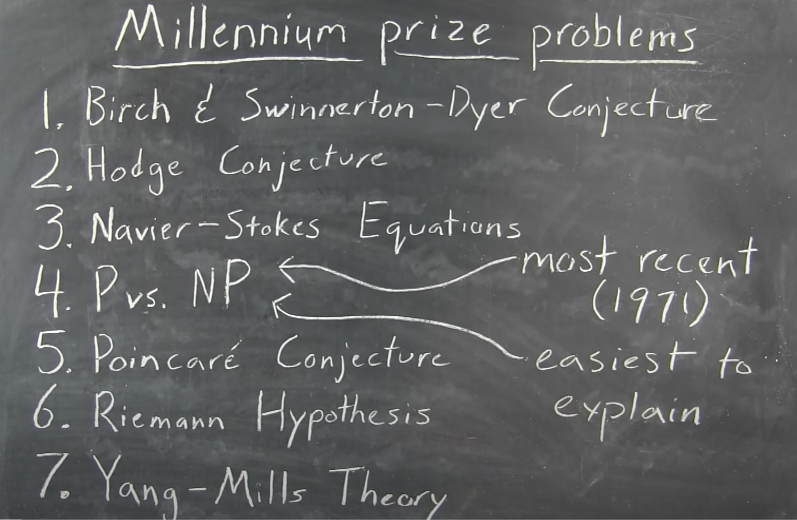
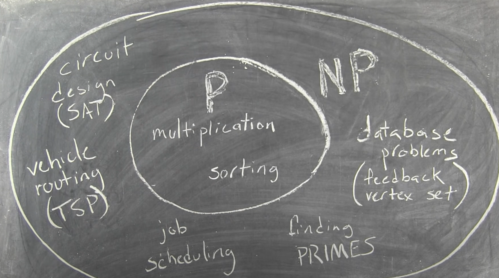
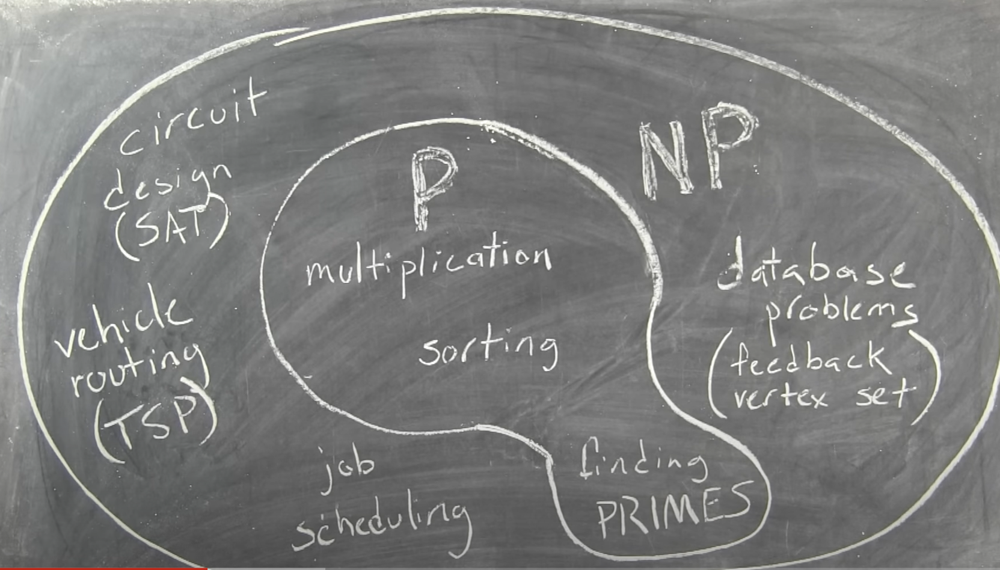
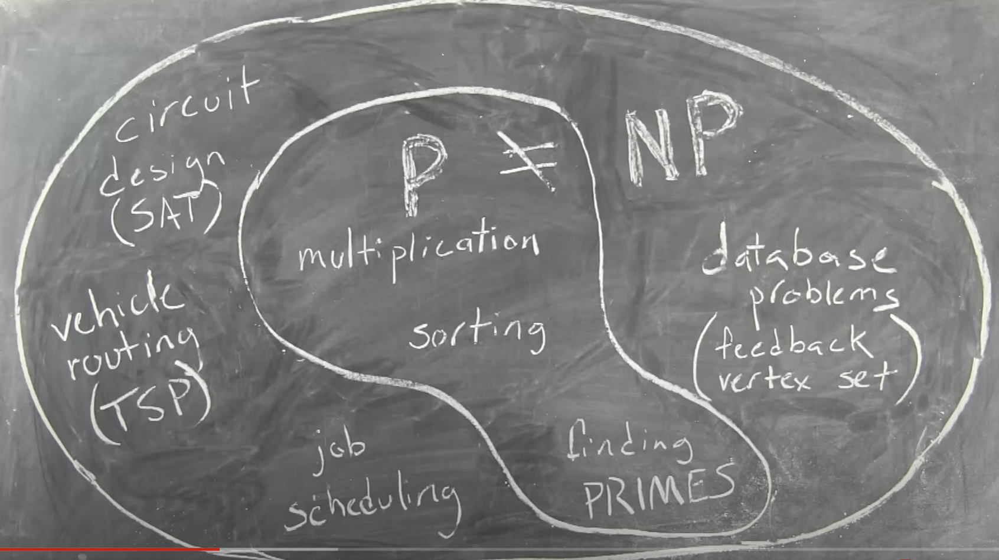
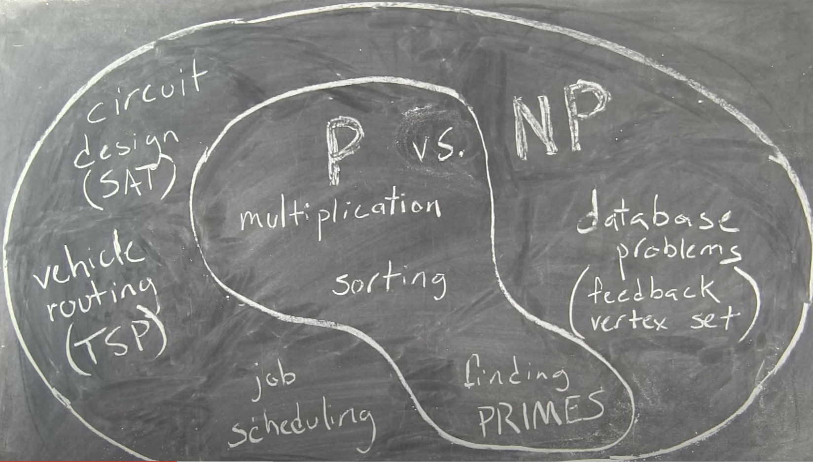
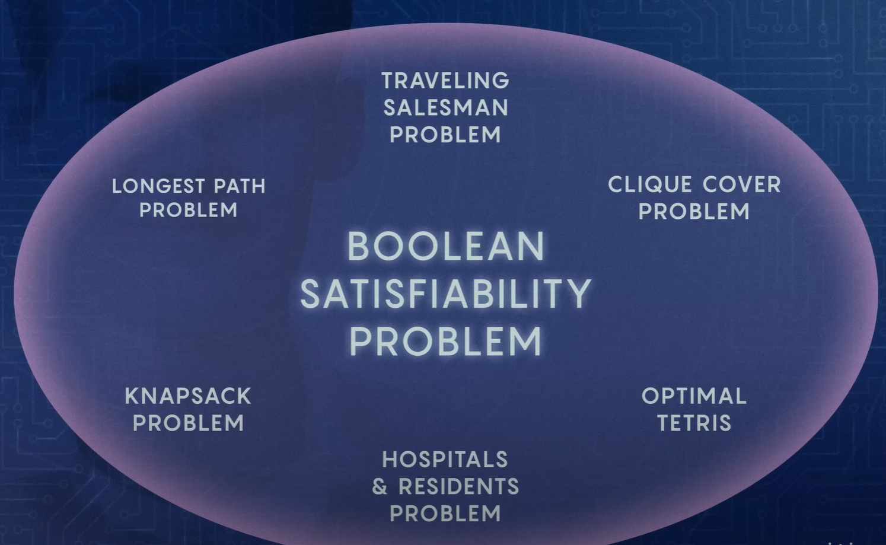
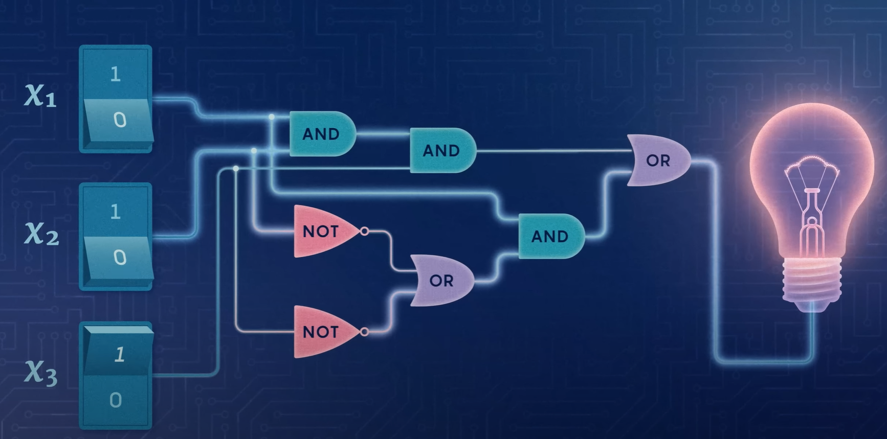

## [Millinium prize problems](https://en.wikipedia.org/wiki/Millennium_Prize_Problems)

1. Birch and Swinnerton-Dyer conjecture (Number Theory)
1. Hodge conjecture (Algebraic Geometry)
1. Navier-Stokes existence and smoothness (Partial Differential Equations)
1. P versus NP problem (Computer Science / Mathematical Logic)
1. Riemann hypothesis (Number Theory)
1. Yang-Mills existence and mass gap (Quantum Field Theory)
1. Riemannian hypothesis (Partial Differential Equations)

## P vs NP

NP stand for "Non-deterministic Polynomial time."

## SAT : famous problem in computer science

Yes, SAT stands for the Boolean satisfiability problem, and it is indeed a famous problem in computer science and computational complexity theory. The problem is as follows: Given a Boolean formula, is there an assignment of truth values (true or false) to the variables in the formula that makes the entire formula true?

Formally, a Boolean formula is in conjunctive normal form (CNF), which is a conjunction (AND) of clauses, where each clause is a disjunction (OR) of literals (variables or their negations). The SAT problem is to determine if there exists an assignment of truth values to the variables that satisfies the entire formula.

The SAT problem is NP-complete, meaning that it is in the class NP (problems for which a solution can be verified quickly), and it is also NP-hard (any problem in NP can be reduced to SAT in polynomial time). The significance of SAT being NP-complete is that if a polynomial-time algorithm exists for solving SAT, then it implies a polynomial-time algorithm exists for solving all problems in NP, effectively P = NP. However, this remains an open question in computer science, and resolving it one way or another has important implications for the theory of computation and practical aspects of algorithmic problem-solving.

[Modèles de calcul](https://www.labri.fr/perso/betrema/MC/index.html)

[Complexité descriptive](https://www.labri.fr/perso/betrema/MC/MC8.html#:~:text=La%20classe%20NP%20poss%C3%A8de%20une,'ex%C3%A9cution%20de%20l'algorithme.)

Temps de calcul
Dans ce chapitre, on ne s'intéresse qu'aux algorithmes dont la terminaison est garantie, et on appelle complexité d'un algorithme son temps de calcul (autrement dit le temps nécessaire à son exécution). On s'intéresse à l'évolution de cette complexité en fonction de la taille des données ; autrement dit, étant donnée une procédure p, on s'intéresse à la variation de la durée du calcul de p(x) en fonction de la taille de l'argument x.

Cette définition de la complexité semble reposer sur une définition précise du temps de calcul ; or tout le monde sait que celui-ci, exprimé par exemple en secondes, dépend de la machine utilisée (vitesse du processeur, temps d'accès à la mémoire, etc.), et décroît rapidement avec les progrès de la technologie. Pour se rapprocher d'une notion indépendante de la technologie, on adopte la convention suivante :

Le temps de calcul de p(x) est le nombre d'instructions élémentaires exécutées pendant ce calcul.

La définition d'une instruction élémentaire dépend à son tour du modèle de calcul considéré, mais un consensus est facile à trouver en pratique ; en cas de doute, on se ramène à une estimation du nombre d'instructions effectuées par le processeur. Une autre solution, employée en particulier pour démontrer les théorèmes fondamentaux de la théorie de la complexité, est d'utiliser le modèle des machines de Turing, pour lequel la définition d'une instruction élémentaire (appelée aussi transition) est non ambigüe. Nous reviendrons plus loin sur ce point.

1.1 Taille des données

Il faut prendre garde aussi à la définition de la taille des données ; celle-ci est par définition égale au nombre de bits nécessaire à la représentation de l'argument x en mémoire, et dépend évidemment du codage de cet argument. Le codage des données est implicite dans la définition de la procédure p, lorsque celle-ci est écrite en C (par exemple) ; lorsqu'un algorithme est décrit de façon moins précise, comme ce sera souvent le cas dans ce chapitre, il faut souvent préciser séparément comment sont codées les données.

Exemple 1. Si l'argument x d'une procédure est lui-même un entier, alors sa taille n vaut :

n = log2 (x) 

Exemple : 
Pour calculer \(\log_2(1024)\), on recherche quel exposant \(y\) doit être élevé à la base 2 pour obtenir \(1024\). En d'autres termes, vous recherchez \(y\) tel que \(2^y = 1024\).

Dans ce cas particulier, \(y = 10\) car \(2^{10} = 1024\).

Donc, \(\log_2(1024) = 10\).

Dans le cas précédent, avec n bits on représente les entiers x compris entre $2^{n-1} $ et $2^n -1$ ; le logarithme binaire doit être interprété comme une valeur entière arrondie (par excès). Par exemple il faut 5 bits pour écrire l'entier 20 en binaire, car 20 est compris entre 24 = 16 et 25 - 1 = 31 ; donc log2 (20) est compris entre 4 et 5, et on l'arrondit à 5.

Exemple 2. Si l'argument d'une procédure est un graphe G, comportant v sommets (vertices en anglais) et e arcs (graphe orienté) ou arêtes (edges — graphe non orienté), on peut coder raisonnablement G par la donnée de l'entier v et de e couples d'entiers — un couple (i, j) pour chaque arc ou arête joignant le sommet numéroté i au sommet numéroté j. La taille du graphe G est donc proportionnelle au nombre de ses arêtes, et s'il n'y a pas d'arêtes multiples (c'est-à-dire s'il y a au plus une arête reliant deux sommets donnés), e est borné par v2.

1.2 Envisager le pire
En général le temps de calcul ne dépend pas que de la taille des données : par exemple tester (par divisions successives) si un entier p est premier est beaucoup plus rapide s'il possède un petit facteur (dans ce cas l'algorithme répond rapidement non), que si p est effectivement premier. On peut essentiellement distinguer deux façons de définir une fonction τ (n) qui exprime le temps de calcul en fonction de la taille n de l'argument x :

complexité moyenne : dans ce cas il faut aussi définir la loi de probabilité de l'argument x ;
complexité au pire, c'est-à-dire valeur maximale de la complexité pour un argument de taille n.
Dans ce chapitre nous nous intéressons seulement à la seconde définition : la complexité τ (n) d'un algorithme est par définition le temps de calcul maximal pour une donnée de taille n.

1.3 Notation grand-O
La complexité de certains algorithmes importants, autrement dit la fonction τ (n), peut être étudiée très en détail dans un cours d'algorithmique ; la référence dans ce domaine est The Art of Computer Programming, par Donald Knuth, qui n'a pas hésité à inventer son propre modèle de machine, pour obtenir des résultats exceptionnellement précis (que ce soit d'ailleurs pour la complexité en moyenne ou pour la complexité au pire, que nous étudions ici). Mais la théorie de la complexité ne s'intéresse qu'à l'ordre de grandeur de la complexité, sans se préoccuper des constantes intervenant dans l'expression de τ (n) ; en outre, on se contente de borner cette fonction, en accord avec la décision de n'étudier que la complexité au pire. La notation suivante, dite grand-O (prononcer "grand-oh", pas "grand-zéro"), est d'un usage constant :

τ (n) = O ( f (n) ) signifie :
il existe une constante C telle que, pour tout n suffisamment grand :
τ (n) < C f (n)

Avec cette notation, on peut affirmer par exemple, sans plus de détails, que la recherche d'un élément dans une liste de taille n a une complexité O (n) ; celle-ci peut tomber à O ( log n ), si la liste est triée et si on utilise un algorithme de recherche dichotomique. Une méthode de tri naïve a une complexité O ( n2 ), de même qu'un algorithme naïf pour multiplier deux entiers de n bits ; dans les deux cas, il existe des algorithmes plus sophistiqués en O ( n log n ) — l'expression "en …" est une contraction de "en temps …" La méthode de Gauss, pour inverser une matrice carrée de m lignes et m colonnes (ou pour calculer son déterminant) possède une complexité O ( m3 ), autrement dit O ( n3/2 ), si n = m2 désigne la taille de la matrice. Etc.

Bien entendu, une complexité O (n) est aussi O ( n2 ), ou O ( n log n ), mais l'inverse n'est pas vrai, et on essaie d'habitude de ne pas tromper le client, en donnant la meilleure estimation possible. D'autre part, la définition spécifie "pour tout n suffisamment grand", afin d'éviter de se préoccuper de la phase d'initialisation de l'algorithme, dont le temps de calcul incompressible devient négligeable dès que n est grand ; dans le contexte de ce chapitre ce scrupule est d'ailleurs secondaire.

2. Classe P
2.1 Algorithmes polynomiaux
La complexité d'un algorithme est dite polynomiale si elle est $O (n^k) $ , pour un certain entier k ; on dit aussi, pour abréger, que l'algorithme lui-même est polynomial. Il existe plusieurs raisons de s'intéresser à cette classe d'algorithmes.

D'abord les algorithmes efficaces sont polynomiaux, autrement dit les algorithmes non polynomiaux sont certainement inefficaces. Cette classification est très grossière, car un algorithme linéaire, donc de complexité O (n), est en général plus efficace qu'un algorithme quadratique, de complexité $O ( n^2 )$ — faire attention quand même aux constantes cachées dans la notation grand-O ; et un algorithme dont la complexité est proportionnelle à $10^{12} n^{100}$ est polynomial, et certainement pas efficace du tout. Notons aussi que certains algorithmes non polynomiaux peuvent être assez efficaces en moyenne, ou pour des classes restreintes de données ; on est seulement sûr qu'il existe des données de taille relativement faible pour lesquelles le temps de calcul est prohibitif (supérieur par exemple à $2^{100}$, qui est lui-même nettement supérieur au nombre d'instructions exécutées par un processeur qui fonctionnerait à 1GHz depuis … la création de l'univers).

En second lieu, cette notion est robuste, c'est-à-dire indépendante de la technologie. La définition du temps de calcul dépend du modèle de calcul : outre le nombre d'instructions effectuées par un processeur, on peut définir le temps de calcul comme le nombre de transitions effectuées par une machine de Turing avant de s'arrêter, ou le nombre de β-réductions appliquées à une λ-expression pour la normaliser, etc. ; mais les preuves d'équivalence entre tous les modèles connus (à l'exception du modèle quantique, qui sort du cadre de ce cours), peuvent être complétées pour montrer que la complexité se transforme de manière polynomiale (en général quadratique).

Enfin les algorithmes polynomiaux forment une classe stable : la composition de deux algorithmes polynomiaux reste polynomiale, et un algorithme construit polynomialement à partir d'appels à des procédures de complexité polynomiale, reste polynomial.

Note : une complexité non polynomiale est souvent exponentielle, mais il existe des cas intermédiaires ; une fonction qui croît plus vite que toute fonction polynomiale est dite super-polynomiale, et une fonction qui croît moins vite que toute fonction exponentielle est dite sous-exponentielle. Par exemple la fonction n → n log n est à la fois super-polynomiale et sous-exponentielle ; la fonction n → $exp (n^{1/2})$ est en général considérée comme sous-exponentielle (mais cela dépend des auteurs et du contexte).

2.2 Problèmes et langages polynomiaux
La théorie de la complexité cherche à classer les problèmes de décision (ceux qui ont une réponse par oui ou par non), selon la complexité des algorithmes capables de les résoudre ; nous reviendrons plusieurs fois sur les (bonnes) raisons de se restreindre à ce type de problème, pour l'instant considérons qu'il s'agit d'un choix simplificateur. La première classe fondamentale est la suivante :

La classe P est formée des problèmes de décision
qui peuvent être résolus par un algorithme polynomial.

Voici deux exemples de problèmes dans P ; on utilise pour les décrire un jargon un peu spécial, traditionnel dans ce contexte (de même que l'habitude de nommer les problèmes en majuscules) : un prédicat est appelé, comme ci-dessus, problème, et l'argument du prédicat devient une instance du problème.

Exemple 1. Problème DIVCOM.

Instance : un couple d'entiers (a, b).
Problème : a et b possèdent-ils un diviseur commun (en dehors de 1) ?
DIVCOM appartient à P ; en d'autres termes, il existe une procédure divcom, de complexité polynomiale, telle que :

divcom (a, b) =	1 si a et b possèdent un diviseur commun > 1, 0 sinon

Remarquons qu'une procédure naïve, qui incrémente un diviseur d à partir de 2, jusqu'à ce que d divise à la fois a et b, ou jusqu'à atteindre le plus petit d'entre eux (disons a), ne convient pas, car sa complexité au pire (lorsqu'il n'existe pas de diviseur commun) est exponentielle par rapport à la taille des données (si a et b sont représentés sur n bits, le nombre d'itérations peut être de l'ordre de 2n ).

Par contre l'algorithme d'Euclide permet de répondre à la question posée en temps polynomial : une caractéristique fondamentale de cet algorithme est que le nombre de divisions nécessaires pour calculer le pgcd est linéaire (c'est-à-dire proportionnel au nombre n de chiffres utilisés pour représenter a ou b), et chaque division est de complexité quadratique, d'où une complexité O ( $n^3$ ). Une fois le pgcd calculé, résoudre DIVCOM est immédiat ; noter le paradoxe : pour résoudre efficacement le problème de décision (existence d'un diviseur commun > 1), on commence par résoudre un problème apparemment plus difficile (trouver le plus grand diviseur commun).

Exemple 2. Problème CHEMIN.

Instance : un graphe orienté G, et deux sommets s et t.
Problème : existe-t-il un chemin dans G reliant le sommet s au sommet t ?
CHEMIN appartient à P ; en d'autres termes, il existe une procédure chemin, de complexité polynomiale, telle que :

chemin (G, s, t) =1 s'il existe, dans G, un chemin s → t, 0 sinon

Ici encore, une procédure naïve, qui examine successivement tous les chemins de source s, jusqu'à en trouver un d'extrémité t, n'est pas en général de complexité polynomiale, car le nombre de chemins dans un graphe est en général une fonction exponentielle de la taille du graphe : pendant la construction d'un chemin, on a un choix à faire, à chaque sommet, entre les différents arcs issus de ce sommet.

Au lieu de parcourir tous les chemins, on peut se contenter de marquer les sommets i tels qu'il existe un arc s → i, puis de marquer les sommets j qu'on peut atteindre à partir de ceux déjà marqués, et ainsi de suite, jusqu'à marquer t, ou jusqu'à stabilisation de l'ensemble des sommets marqués. Cet algorithme est de complexité polynomiale : le nombre de sommets marqués augmente au moins de 1 entre deux étapes consécutives de l'algorithme (sinon celui-ci est terminé), donc le nombre d'étapes est borné par le nombre n de sommets du graphe ; et chaque étape (examiner les arcs issus des sommets déjà marqués) est clairement polynomiale. La structure de données utilisée pour représenter le graphe influe sur la complexité exacte de l'algorithme, et trouver une structure optimale est un sujet d'étude classique en algorithmique ; mais la complexité reste polynomiale même avec une représentation brutale de la liste des arcs (sans accès direct aux arcs de source donnée).

Terminologie : dans cette section un élément de P est un problème de décision ; dans beaucoup de cours et d'articles sur la complexité, un élément de P est un langage. Cela revient au même, car un problème de décision est un prédicat A, dont l'argument u peut être considéré comme un mot de n bits, et le langage L associé à A est l'ensemble des mots dont A est la fonction caractéristique (voir chapitre 4) ; autrement dit la relation entre le problème de décision A et le langage L est la suivante :

u ∈ L ⇔ A (u) = 1

Remarquons aussi que, lorsque A est un prédicat, écrire "A (u) = 1" est un pléonasme (comme le savent les — rares — programmeurs sérieux), car cette expression est vraie si et seulement si A est vrai ; on écrira donc plus simplement :

L = { u | A (u) }

D'autre part le mot algorithme est souvent remplacé par machine de Turing, qui est plus précis, mais fait référence (souvent inutilement) à un modèle de calcul particulier. Avec cette terminologie, la définition de P devient:

La classe P est formée des langages
reconnus (ou acceptés) par les machines de Turing polynomiales.

3. Classe NP
3.1 Algorithmes non déterministes
La classe NP possède une définition moins naturelle que celle de P, et son nom est trompeur : il ne signifie pas "non polynomial", mais polynomial non-déterministe. La classe NP est donc une extension de la classe P, en autorisant des choix non déterministes pendant l'exécution de l'algorithme. Si le modèle de calcul est celui des machines de Turing, on autorise plusieurs transitions à partir d'un état et d'un symbole lu sur la bande.

Cette notion est directement inspirée de celle d'automate non déterministe, où la lecture d'une lettre d'un mot peut conduire, à partir d'un état donné, à plusieurs états différents. Rappelons qu'un mot u est accepté (on dit aussi reconnu) par un automate non déterministe s'il existe un chemin, étiqueté par u, qui conduise d'un état initial à un état terminal.

Les différentes exécutions d'un algorithme non déterministe, pour un argument u, sont les branches d'un arbre, autrement dit les chemins depuis la racine (départ de l'exécution) vers les feuilles (terminaison de l'exécution) ; chaque noeud interne de l'arbre correspond à un choix. Pour définir NP, on se restreint au cas où toutes les branches sont finies, autrement dit où toutes les exécutions terminent ; restent deux questions :

que calcule un algorithme non déterministe ?
comment mesurer le temps de calcul d'un tel algorithme ?
La première question n'a guère de réponse satisfaisante en général, c'est pourquoi on entend peu parler d'algorithme non déterministe dans les cours de programmation… Il faut se restreindre aux problèmes de décision pour pouvoir définir une convention intéressante, analogue à celle employée pour les automates ; c'est la première raison pour laquelle la classe P ne contient, par définition, que des problèmes de décision ; sinon étendre P en autorisant le non-déterminisme, n'aurait guère de sens.

A partir de maintenant, on ne considère donc que les algorithmes non déterministes possédant la propriété suivante : chaque branche de l'arbre d'exécution, pour un argument u donné, calcule 0 ou 1 (on dit aussi que chaque exécution se termine par refuse ou accepte). On convient alors, comme pour les automates, que la réponse de l'algorithme est "oui" s'il existe une branche qui calcule 1 (autrement dit s'il existe une exécution qui accepte l'argument u) ; par conséquent la réponse est "non" si toutes les branches calculent 0 (autrement dit si toutes les exécutions refusent l'argument u) ; on notera la dissymétrie de cette définition.

En ce qui concerne le temps de calcul, on convient, conformément au principe "envisager le pire", que c'est celui de la plus longue branche (la longueur d'une branche est mesurée en nombre d'instructions), que celle-ci calcule 0 ou 1.

3.2 NP = P non déterministe
Avec ces conventions, on a la définition fondamentale suivante :

La classe NP est formée des problèmes de décision
qui peuvent être résolus par un algorithme
polynomial non déterministe.

Variante : avec une autre terminologie, équivalente et fréquente dans ce contexte (voir ci-dessus), cette définition devient :

La classe NP est formée des langages
reconnaissables par une machine de Turing
polynomiale non déterministe.

Tout algorithme non déterministe peut être simulé par un algorithme déterministe, qui parcourt récursivement l'arbre de tous les choix possibles ; les fonctions calculables dans un modèle le sont donc dans l'autre, le non-déterminisme n'apporte rien de ce point de vue. Par contre la complexité d'un algorithme non déterministe est mesurée par le temps d'exécution de la plus longue branche, alors que la complexité de sa simulation déterministe est égale au temps d'exécution de l'arbre entier (ou de la portion d'arbre qui précède une acceptation) ; lorsque la première est polynomiale, la seconde est en général exponentielle (dès que l'arbre est suffisamment équilibré).

En fait il existe beaucoup de problèmes dans NP pour lesquels aucun algorithme polynomial déterministe n'est connu, ce qui semble indiquer, avec une grande vraisemblance, que la classe NP est plus large que la classe P. La réponse à la question :

P = NP ?

est donc très vraisemblablement négative, mais, aucune démonstration de ce résultat négatif n'a été trouvée en 30 ans de recherche très active, d'où la célébrité de ce problème, qui intrigue tous les théoriciens de l'informatique.

3.3 Certificats et vérifieurs
Il existe une variante de la définition de NP qui élimine le non-déterminisme, en codant la succession de choix non déterministes par un mot x ; en effet une branche d'un arbre peut être codée par une suite de (petits) entiers : par exemple 4,1,2… code la branche qui débute par le quatrième fils de la racine (appelons-le s), puis passe par le premier fils de s (appelons-le t), puis par le second fils de t, etc. Le mot x devient le second argument de l'algorithme ; cet algorithme déterministe à deux variables (le non-déterminisme se trouve en quelque sorte externalisé dans le second argument), est appelé vérifieur pour le problème de décision correspondant :

Une procédure (déterministe) booléenne V à deux variables
est un vérifieur pour le problème de décision A si et seulement si :
A ( u ) ⇔ ∃x V ( u, x )

Un argument x qui satisfait le prédicat V (u, x) est appelé un certificat de u ; d'autre part, un vérifieur est dit polynomial si sa complexité est O ( n k ), où n désigne la taille du premier argument u ; cette convention garantit que la taille du certificat est elle-même bornée par une fonction polynomiale de n (sinon, V n'aurait même pas le temps de lire le certificat).

En comparant les conventions adoptées pour définir ce que calcule un algorithme non déterministe, et pour définir la complexité d'un tel algorithme, avec les conventions données ci-dessus pour un vérifieur, on prouve facilement (nous ne donnerons pas les détails) le résultat suivant :

La classe NP est formée des problèmes de décision
qui possèdent un vérifieur polynomial.

Cette nouvelle définition de NP est celle qu'on utilise presque toujours en pratique. Elle illustre aussi la nature des problèmes appartenant à cette classe, qu'on peut résumer par : deviner et vérifier (en temps polynomial) ; on n'a pas à rechercher le certificat (ce qui demande en général un temps de calcul exponentiel), on est autorisé à le deviner, mais ensuite on a un algorithme polynomial de vérification du certificat.

Comme on l'a déjà mentionné, les problèmes dans NP sont en général plus difficiles à résoudre (du point de vue du temps de calcul) que les problèmes dans P, mais on verra dans la section suivante (et encore plus dans le chapitre suivant) qu'il existe des problèmes naturels et simples à formuler encore plus difficiles : appartenir à NP est une contrainte (celle de la vérification en temps polynomial), autrement dit la classe NP est loin d'être la classe des problèmes les plus difficiles à résoudre, comme la célébrité de la question P = NP pourrait le laisser croire.

3.4 Premiers exemples
Il est temps de donner deux exemples, sur le modèle de ceux donnés pour illustrer la définition de P.

Exemple 1. Problème COMPOSITE.

Instance : un entier m.
Problème : m possède-t-il un diviseur d non trivial (différent de 1 et m) ?
C'est un problème qui rentre manifestement dans la catégorie deviner et vérifier, un certificat est un diviseur d ! On vérifie ensuite en temps polynomial que d est différent de 1 et m (facile en temps linéaire, en comparant les chiffres de d et ceux de m), puis que d divise m (l'algorithme élémentaire de division est de complexité quadratique en fonction du nombre de chiffres des opérandes).

Exemple 2. Problème CHEMIN-HAMILTONIEN.

Instance : un graphe orienté G, et deux sommets s et t.
Problème : existe-t-il un chemin dans G, reliant le sommet s au sommet t, et passant par chaque sommet de G une fois et une seule ?
C'est à nouveau un problème de la catégorie deviner et vérifier, un certificat est un chemin γ ! On vérifie ensuite en temps linéaire (en fonction du nombre n de sommets de G ) que γ part bien de s, arrive bien en t, et passe par chaque sommet une fois et une seule (un tableau de compteurs de visites, un par sommet, fait l'affaire, pendant qu'on lit les n premiers sommets qui composent γ).

On ne connaît pas d'algorithme (déterministe) polynomial pour résoudre le problème CHEMIN-HAMILTONIEN. L'astuce utilisée pour résoudre le problème CHEMIN (voir section 2), ne fonctionne plus, car la contrainte "hamiltonienne" oblige à garder en mémoire les sommets déjà visités, et à explorer les chemins sans répétitions un par un. D'autre part on verra plus loin que ce problème est NP-complet, ce qui signifie que la découverte d'un algorithme polynomial pour le résoudre impliquerait P = NP (et rapporterait accessoirement un million de dollars à son auteur), ce qui est très peu vraisemblable.

Le problème COMPOSITE a un statut très différent, pour deux raisons :

le problème complémentaire, défini en inversant les réponses "oui" et "non", consiste à savoir si un entier est premier, et est appelé PRIME par les anglo-saxons. Ce problème illustre la dissymétrie de la définition de NP (voir section suivante) : un certificat pour le problème COMPOSITE est évident, et consiste en un diviseur, comme on l'a vu ; un certificat de primalité est très différent, et on peut douter à première vue qu'il en existe. C'est pourtant vrai, mais produire un tel certificat utilise des résultats mathématiques assez sophistiqués (principalement : lorsque p est premier, les entiers non nuls modulo p forment un groupe pour la multiplication, et ce groupe est cyclique) ; bref PRIME est dans NP, mais c'est un exemple où la définition du problème ne débute pas par un quantificateur existentiel le faisant entrer immédiatement dans la catégorie deviner et vérifier ;
on connaît depuis longtemps des algorithmes déterministes presque polynomiaux (au sens en particulier où certains de ces algorithmes sont polynomiaux si certaines conjectures classiques en théorie des nombres sont vraies) pour déterminer si un entier est premier ou non, mais c'est seulement en 2002 qu'a été découvert un algorithme polynomial (algorithme AKS, du nom de ses inventeurs, Agrawal, Kayal et Saxena), prouvant que PRIME et COMPOSITE (lorsque l'algorithme est déterministe, échanger les réponses "oui" et "non" est indolore) sont en fait dans P. Noter que l'algorithme AKS, dans sa version originale, est beaucoup moins efficace que les tests de primalité classiques utilisés jusque là, ce qui confirme que regrouper tous les algorithmes polynomiaux dans la même classe est très grossier, du point de vue pratique (voir les remarques au début de la section 2) ; voir www.primepages.org pour tous les détails.
4. Classe co-NP
Le problème complémentaire (ou dual) du problème A est le problème B = ¬ A ; autrement dit B est déduit de A en échangeant les réponses "vrai" et "faux" (ou "oui" et non", ou 0 et 1). Ce vocabulaire est cohérent avec celui des ensembles : le langage associé à B est le complémentaire du langage associé à A.

A priori il semble évident qu'un problème et son complémentaire appartiennent à la même classe de complexité ; c'est exact tant qu'on considère des algorithmes déterministes. Mais la classe des problèmes dont le complémentaire est dans NP est une nouvelle classe, notée co-NP, et définie par :

A ∈ co-NP si et seulement s'il existe un algorithme polynomial V tel que
A ( u ) ⇔ ∀x V ( u, x )

En effet, en prenant la négation de la condition ci-dessus, on a :

¬ A ( u ) ⇔ ∃x ¬V ( u, x )

et donc le problème complémentaire B admet ¬V pour vérifieur. Un vérifieur est déterministe, donc l'échanger avec sa négation ne change rien ; par contre, la définition de NP utilise le quantificateur existentiel ∃ , qui est remplacé par le quantificateur universel ∀ dans la définition de co-NP.

On ne voit aucune raison pour qu'on puisse se débarrasser systématiquement du quantificateur ∃ dans la définition de NP, d'où la conjecture P ≠ NP ; de même on ne voit aucune raison pour qu'on puisse remplacer systématiquement le quantificateur ∀ par le quantificateur ∃ dans la définition de co-NP, d'où la conjecture :

NP ≠ co-NP

Cette seconde conjecture est moins médiatique, mais pratiquement aussi importante que la conjecture P ≠ NP. L'implication suivante est évidente :

P = NP ⇒ NP = co-NP

puisque, pour un algorithme déterministe, il n'y a pas de différence entre un problème et son complémentaire ; autrement dit la classe P est égale à co-P (qui ne mérite donc pas de caractères gras…). En prenant la contraposée de l'implication précédente, on a donc :

NP ≠ co-NP ⇒ P ≠ NP

Il n'est pas impossible qu'on ait à la fois P ≠ NP et NP = co-NP, mais personne ne le croit.