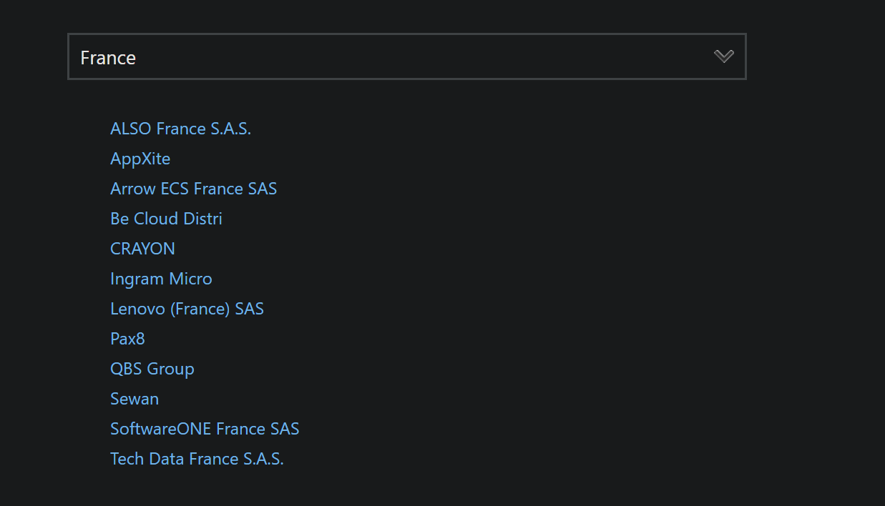
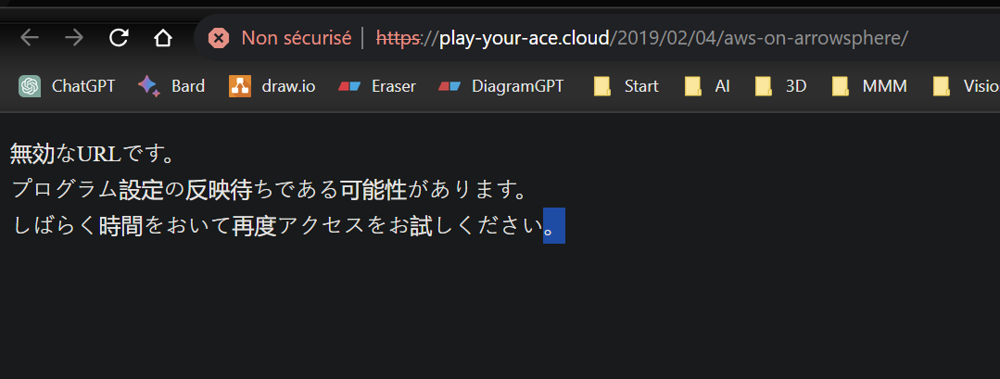

## Step 2

1. identifiy complexity & security risk
2. determine priority & dependencies
3. Adress EOL & EOS / End of Life & End of Support
4. provide cloud consumption cost analysis

+data record management requirements dictated by law in Healthcare, Financial Services,

## Step 3 / Equipment valuation

Data center Buyout program

- Inventory of customers servers
- Appraise value of equipment
- Competitive buyout offer

## Step 4 / Workload Mapping

Migration mapping based on assesment
Map out workload migration
Financial solution during the process

## Step 5 / Cloud Migration

Complete backup of customers workload
Performing migration

## Step 6 / Data Center Decommissioning

Securely sanitize data

## Step 7 / Ongoing management & optimization

## « Golden Signals »

La latence
Le trafic
La saturation des ressources
Le taux d’erreurs

## Exemple avec Tehtris : partenaires distributeurs

"distribution partner" ou "distributor partner"

Arrow ECS est partenaire distributeur de Tehtris ainsi que :

Ignition Technology / Ignition Technology est un distributeur de sécurité pour le monde du SaaS. Il se repose sur un réseau de partenaires, pour permettre la transformation des entreprises et leur sécurisation via la commercialisation de solutions de cybersécurité innovantes et émergentes.

UGAP / Les offres de TEHTRIS sont référencées au sein du catalogue de l’UGAP (Union des groupements d’achats publics) dans la partie logiciels multi-éditeurs qui est mis à disposition de tous les acheteurs publics.

## Cloud Distribution partner

[Find the right Google Cloud partner](https://cloud.google.com/find-a-partner/?products=Chrome&location=france)

[Microsoft](https://partner.microsoft.com/fr-fr/partnership/cloud-solution-provider/find-a-provider#)

    ALSO France S.A.S.
    AppXite / As the cloud becomes mainstream, the distributor’s purpose shifted from distribution to aggregation. The successful cloud aggregators of today are able to add meaningful value to their channels and help them navigate the constantly changing cloud market.
    
    Arrow ECS France SAS -> https://www.arrow.com/globalecs/fr/produits/microsoft/ : 404 - Page non trouvée
  
    Be Cloud Distri
    CRAYON
    Ingram Micro
    Lenovo (France) SAS
    Pax8
    QBS Group
    Sewan
    SoftwareONE France SAS 
    Tech Data France S.A.S.

[AWs](https://partners.amazonaws.com/search/partners/?keyword=arrow&loc=PARIS)

Arrow is a technology enablement company that brings innovative IT solutions to solve complex business challenges. We deliver cloud value-added distribution, business consulting and channel enablement services to technology manufacturers and channel partners, we help to optimize the cloud spend; guide on building competencies; design support to ensure smooth migrations to cloud and lead generation

https://partners.amazonaws.com/partners/001E000000pb2kvIAA/Arrow

https://play-your-ace.cloud/2019/02/04/aws-on-arrowsphere/

https://www.ibm.com/partnerplus/directory/company/3295

https://www.arrow.com/globalecs/fr/produits/ibm/

https://www.arrow.com/globalecs/fr/produits/

    ArrowSphere
    Artificial Intelligence
    Cloud
    Informatique
    Data Management
    Informatique edge
    Réseau
    Sécurité / Tehtris n'est pas listé dans cette catégorie
    Stockage
    Service de support
    Virtualisation

No adobe, no ERP, no CRM ?

## cloud souverain

[Numspot lancement prévu 2024](https://www.lemondeinformatique.fr/actualites/lire-cloud-de-confiance-numspot-lancera-ses-offres-mi-2024-92300.html)