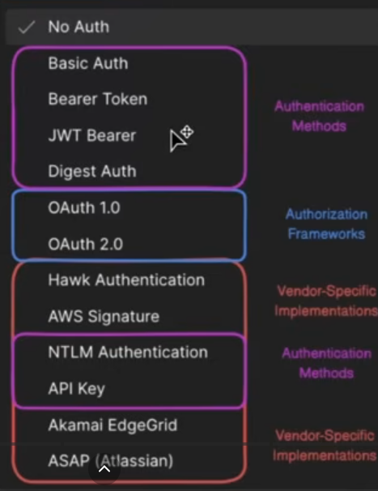
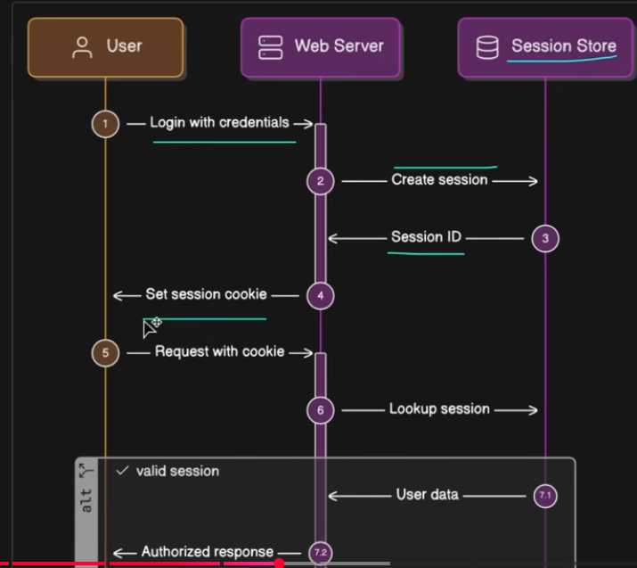

[link video](https://www.youtube.com/watch?v=iX8g4LqF8p8)
# Introduction 

Common mistakes : 

- Authentification methods != Authorization frameworks
- Treat JWT (Jason Web Token) as an authentication type (as it is a token)
- Confuse Bearer Auth & JWT
- Call OAuth2 an authentication method (as it is an authorization framework)
- Mix up SSO in with authentication method

# Basic Auth Methods

Authentication : who is the user is ?

- Basic
- Digest (MD5 hashing)
- API Keys
- Session

API Key : includes in the header Authorisation (ApîKey ab45av5c655 or or X-API-Key ab45av5c655)
API key are stored in a database (with key_hash, user_id, scopes...)

JWT stores more information in the key$

Session based with session storage like Redis (with built-in key expiration)

