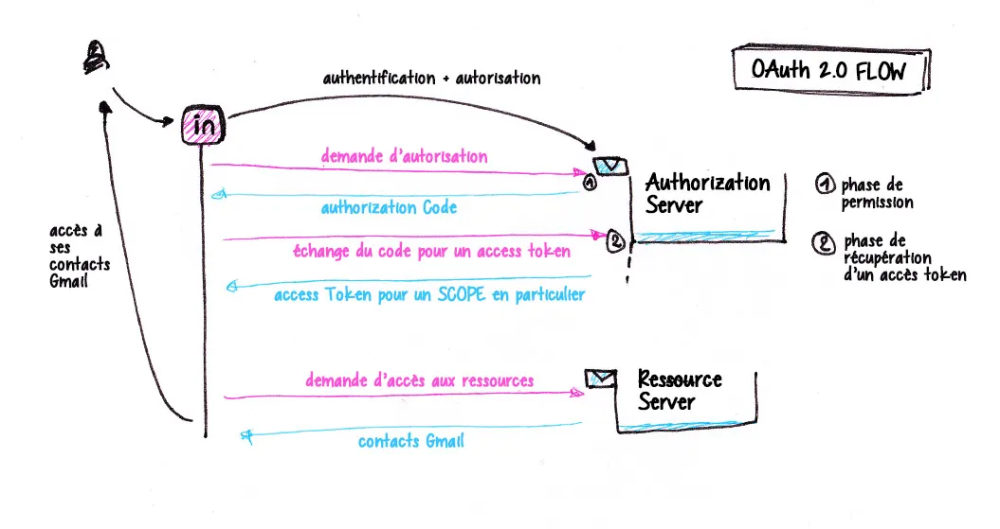
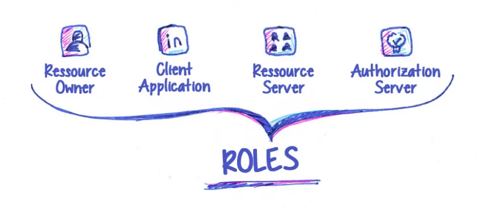
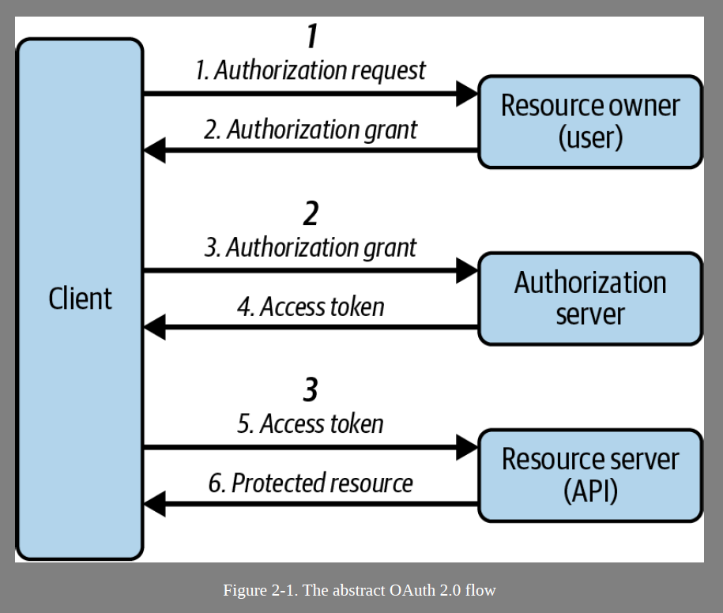
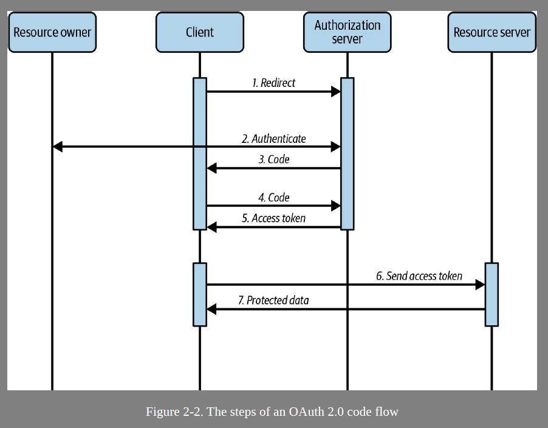

# Preambule

[Article sur Medium](https://loan-truong.medium.com/le-protocole-oauth2-0-a845773bec21)

usecase : Emma souhaite récupérer ces contacts Gmail sur son réseau professionnel LinkedIn pour pouvoir les ajouter.

 Notons que dans le process d’identification, LinkedIn ne s’est pas du tout occupé de l’authentification de l’utilisateur. Cela va être géré par l’intermédiaire du protocole Open ID connect qui va apporter une sur-couche à OAuth2.

- Ressource owner. Celui à l’origine de la demande (l’utilisateur final), dans notre cas Emma.
- Client Application. C’est l’application ou le service qui va aller demander l’autorisation pour accéder une partie des ressources. Ici, LinkedIn. 2 types de client application :
    - Le client classique ou client confidentiel est une application qui va pouvoir s’authentifier de manière sécurisée auprès de l’Authorization Server.
    - Le client public, qui comme son nom l’indique va exposer certaines informations au sein du navigateur.
- Ressource Server. Le serveur qui héberge la ressource protégée. C’est lui qui va accepter ou non, de partager une ressource.
- Authorization Server. Le serveur qui va fournir les access tokens aux clients. Un access token est un jeton qui va permette à son possesseur d’avoir le droit d’accéder à une ressource. Après la confirmation de l’authentification par l’utilisateur (Emma). Le serveur va ensuite donner une autorisation au Client Application d’avoir accès aux contacts Gmail de l’utilisateur.

# 02 OAuth 2.0 distilled

## Roles
The framework defines four main roles involved in any flow:
- Resource owner
    - The entity granting access to resources, typically a user
- Resource server
    - The entity hosting the protected resources, typically a backend API
- Client
    - The application calling an API with an access token
- Authorization server
    - The entity that authenticates the resource owner and issues access tokens to the client

There are two types of access tokens: opaque and structured tokens. Opaque
tokens are random strings with a (relatively) high entropy, and Structured tokens, with a format that is self-contained (JWT)

## client capabilities

Authorization servers should issue tokens only to clients they trust

The authorization server associates a set of client capabilities with a client ID. The client uses this client ID to identify itself at the authorization server, and its client credentials to authenticate (when
applicable)

# Architecture

- Identity management (IAM)
- API management
- Entitlement management

IAM systems support protocols and techniques such as :

- the Lightweight Directory Access Protocol (LDAP)
- the Security Assertion Markup Language (SAML)
- the System for Cross-domain Identity Management (SCIM)
- OpenID Connect
- OAuth 2.0

More information : 

- LDAP (Lightweight Directory Access Protocol) : utilisé pour accéder et gérer des annuaires d’utilisateurs (ex : Active Directory).
- SAML (Security Assertion Markup Language) : permet le Single Sign-On (SSO) entre différents services.
- SCIM (System for Cross-domain Identity Management) : sert à automatiser la gestion des identités (provisionnement/déprovisionnement des comptes).
- OpenID Connect (OIDC) : couche d’authentification basée sur OAuth 2.0.
- OAuth 2.0 : protocole d’autorisation permettant de donner accès à des ressources sans partager les identifiants.

OAuth is recommended as the main protocol in IAM for protecting APIs
