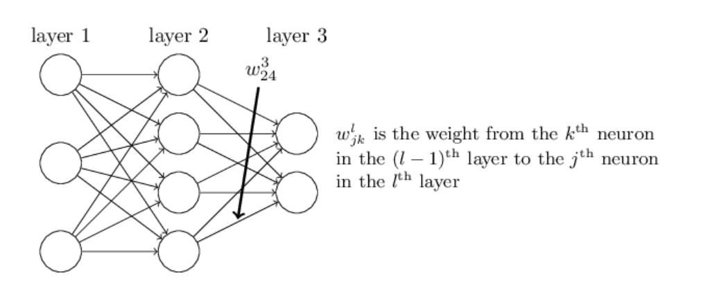
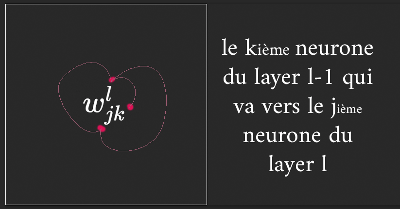
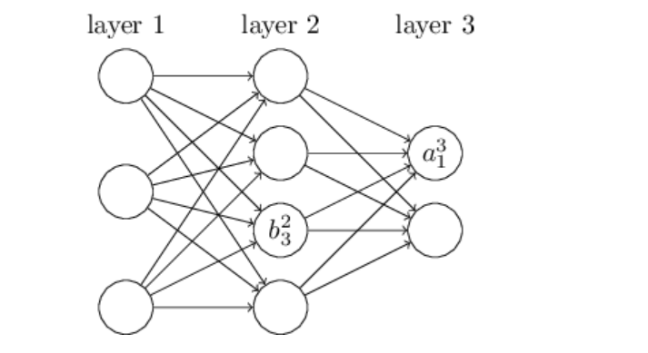
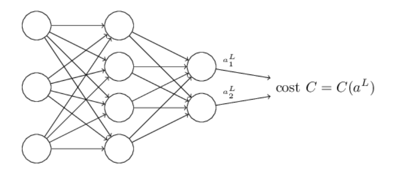

from

http://neuralnetworksanddeeplearning.com/chap2.html

# $w^l_{jk} $

$w^3_{24} $ : 4eme neurone, 2eme layer (3-1) vers le 2eme neurone du layer 3

we use $b^l_j$ for the bias of the jth neuron in the lth layer. And we use $a^l_j$ for the activation of the jth neuron in the lth layer.

activation of the $j^{th}$ neuron in the $l^{th}$ position
$a_j^l = \sigma (\sum _k w^l_{jk}a^{l-1}_k + b^l_j)  $   
with vectorization (way of escaping index hell)
$a^l = \sigma (w^la^{l-1}+b^l) $
and sometimes we use the weighted input $z^l$

$a^l = \sigma (z^l) $

## Goal of backpropagation 

compute the partial derivatives 
$\delta C / \delta w $ and $\delta C / \delta b $ if the cost function

Quadratic cost :
$C = \frac{1}{2n}\sum_x ||y(x)  - a^L(x)||^2  $
n : total number of training examples
y(x) = corresponding desired output

**1st assumption** : cost function can be written as an average 
$C = \frac{1}{n}\sum_x C_x  $
with cost for a single training example is
$C_x = 1/2 ||y-a^L||^2 $
So computing the partial derivatives
$\delta C_x / \delta w $ and $\delta C_x / \delta b $ for a single training example -> recovering $\delta C / \delta w $ and $\delta C / \delta b $ by averaging over training examples
With this assumptions, we drop the x subscript and C$_x$ becomes C

**2nd assumption** : cost can be written as a function of the outputs from the neural network

$C=C(a^L) $

$C_x = \frac{1}{2} ||y-a^L||^2 = \frac{1}{2n}\sum_j||y_j  - a^L_j||^2  $ 

